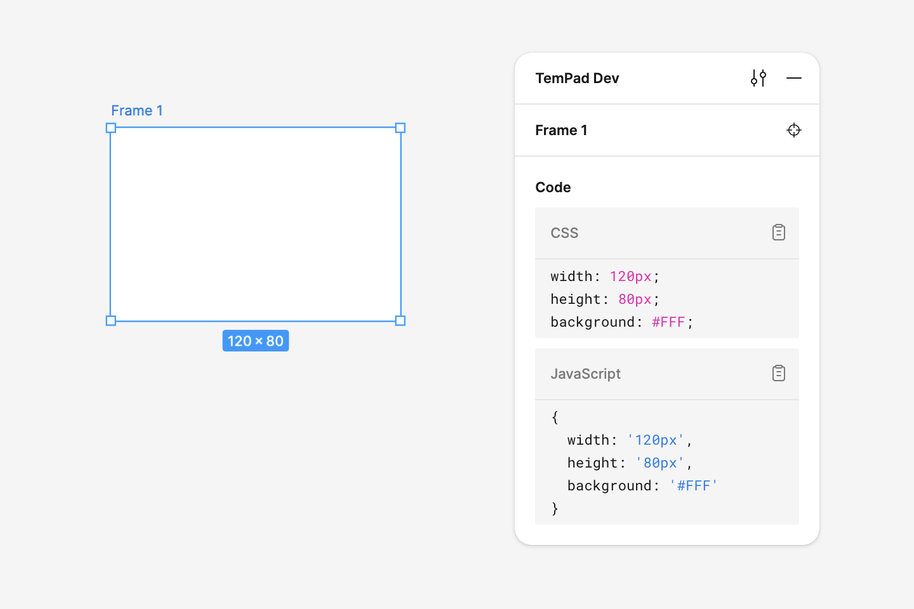
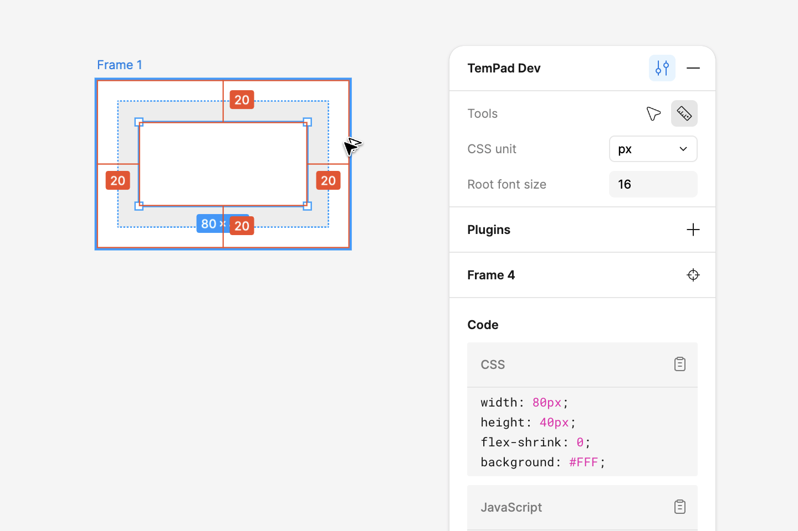
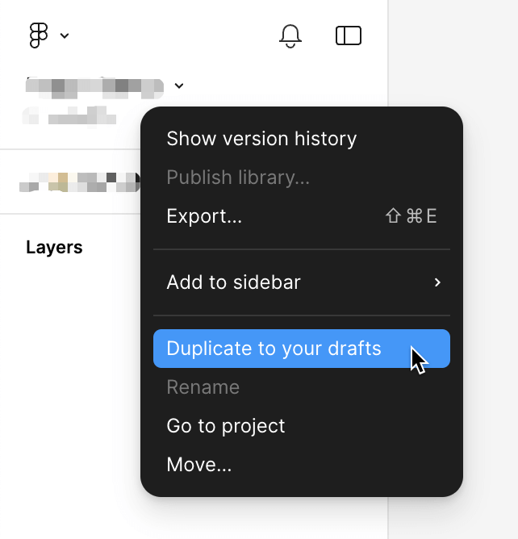

<!-- markdownlint-disable MD033 MD041 -->
<p align="center">
  <picture>
    <source media="(prefers-color-scheme: dark)" srcset="assets/hero-dark.svg">
    <source media="(prefers-color-scheme: light)" srcset="assets/hero-light.svg">
    
  </picture>
</p>

<p align="center">Inspect panel on Figma, for <b>everyone</b>.</p>

<p align="center">
  <a href="https://chrome.google.com/webstore/detail/tempad-dev/lgoeakbaikpkihoiphamaeopmliaimpc"></a>
  <a href="https://discord.gg/MXGXwtkEck"></a>
</p>

<p align="center">
  <a href="https://github.com/ecomfe/tempad-dev/actions/workflows/check-rewrite.yml"></a>
</p>

<p align="center">
  <picture>
    <source media="(prefers-color-scheme: dark)" srcset="assets/code-dark.png">
    <source media="(prefers-color-scheme: light)" srcset="assets/code-light.png">
    
  </picture>
</p>

---

## Key features

### Inspect CSS code

<picture>
  <source media="(prefers-color-scheme: dark)" srcset="assets/code-dark.png">
  <source media="(prefers-color-scheme: light)" srcset="assets/code-light.png">
  
</picture>

Select any element, and you can obtain the CSS code through the plugin's Code panel. In addition to standard CSS code, TemPad Dev also provides styles in the form of JavaScript objects, making it convenient for use in JSX and similar scenarios.

<picture>
  <source media="(prefers-color-scheme: dark)" srcset="assets/unit-dark.png">
  <source media="(prefers-color-scheme: light)" srcset="assets/unit-light.png">
  
</picture>

You can configure CSS units and root font size to convert `px` dimensions in CSS to `rem` units. You can also apply a `scale` factor to scale `px` values according to your handoff requirements.

> [!WARNING]
> Switching units only affects the output in the TemPad Dev panel, not the Figma canvas.

### Deep select mode

<picture>
  <source media="(prefers-color-scheme: dark)" srcset="assets/deep-dark.png">
  <source media="(prefers-color-scheme: light)" srcset="assets/deep-light.png">
  
</picture>

In Figma's read-only view, selecting nodes requires double-clicking to drill down, and it often takes repeated double-clicks to select the lowest-level node. Although Figma offers a <kbd>⌘</kbd> + click shortcut, many users are unaware of this feature and need to perform extra key operations each time. Therefore, TemPad Dev provides a deep select mode in preferences.

### Measure to selection mode

<picture>
  <source media="(prefers-color-scheme: dark)" srcset="assets/measure-dark.png">
  <source media="(prefers-color-scheme: light)" srcset="assets/measure-light.png">
  
</picture>

In Figma's read-only view, you need to hold <kbd>⌥</kbd> and move the cursor to display the spacing between other nodes and the selected node. For similar reasons to the deep select mode, TemPad Dev provides a measure to selection mode in preferences.

### Scroll selection into view

<picture>
  <source media="(prefers-color-scheme: dark)" srcset="assets/scroll-dark.png">
  <source media="(prefers-color-scheme: light)" srcset="assets/scroll-light.png">
  
</picture>

When you hover over a node name section in TemPad Dev's inspect panel, a corresponding button appears. Clicking it will scroll the current selection to the center of the Figma viewport. Figma has a similar <kbd>⇧2</kbd> shortcut, but it zooms in to fill the viewport, which often doesn't meet the needs. Figma actually exposes an interface in the plugin API to move and zoom to 100%, so we also provide this capability as a supplement.

---

### Plugins

<picture>
  <source media="(prefers-color-scheme: dark)" srcset="assets/plugins-dark.png">
  <source media="(prefers-color-scheme: light)" srcset="assets/plugins-light.png">
  
</picture>

Plugins allow you to customize the built-in code output or add custom code blocks.

A TemPad Dev plugin is a simple JavaScript file that exports a plugin object as its `plugin` named export. To install a plugin, paste the plugin file's URL into the _Preferences > Plugins_ section. Some built-in plugins can also be enabled by using `@{name}` syntax (e.g., `@foo`), which corresponds to the plugin names in our [plugin registry](https://github.com/ecomfe/tempad-dev/blob/main/plugins/available-plugins.json).

> [!NOTE]
> Plugin code is stored in the browser's local storage. Plugins are not versioned or auto-updated, so you must manually update them from the UI.

#### Creating plugins

Use the fully typed `definePlugin` function from the `@tempad-dev/plugins` package to simplify plugin creation.

```sh
npm install -D @tempad-dev/plugins # or pnpm add -D @tempad-dev/plugins
```

Here is an example of a simple plugin that overrides the built-in CSS code block and hides the JavaScript code block:

```ts
import { definePlugin } from '@tempad-dev/plugins'

export default definePlugin({
  name: 'My Plugin',
  code: {
    css: {
      title: 'Stylus', // Custom code block title
      lang: 'stylus', // Custom syntax highlighting language
      transform({ style }) {
        return Object.entries(style)
          .map(([key, value]) => `${key} ${value}`)
          .join('\n')
      }
    },
    js: false // Hides the built-in JavaScript code block
  }
})
```

See [Justineo/tempad-dev-plugin-kong](https://github.com/Justineo/tempad-dev-plugin-kong/) for more comprehensive examples.

> [!NOTE]
> Plugin file must be a valid ES module and have the plugin object as the `default` export.

Currently, we support 4 plugin hooks:

- `transform`: Converts the style object or code into a string format for the code block. Useful for custom structures, such as Tailwind CSS or UnoCSS.
- `transformVariable`: Converts CSS variables into alternate formats, e.g., converting them to Sass variables for design tokens.
- `transformPx`: Converts pixel values into other units or scales.
- `transformComponent`: Converts the design component object into a dev component object or a strin for the code block. Useful for generating component code for design systems.

> [!TIP]
> To include JavaScript variables in generated CSS, wrap the variable name in `\0` characters. This will convert it into string interpolation for JavaScript.
> e.g. if you return `\0foo\0` as the return value, an input of `calc(var(--foo) + 10px)` will be transformed into a JavaScript template string as `` `calc(${foo} + 10px)` ``.

Additionally, you can specify a custom `title` and `lang` for the code block or hide the built-in code block by setting it to `false`.

For full type definitions and helper functions, see [`plugins/src/index.ts`](./plugins/src/index.ts).

#### Deploying a plugin

Ensure your plugin is accessible via a URL that supports cross-origin requests, such as a GitHub repository (or Gist). For instance, you can use a raw URL:

```text
https://raw.githubusercontent.com/{username}/{repo}/refs/heads/{branch}/{filename}.js
```

> [!NOTE]
> Plugin URLs must support cross-origin requests. Raw URLs provided by GitHub or Gist are generally suitable.

Plugins run in a Web Worker, so they do not impact the main thread or access the DOM, safeguarding performance and security. Only a limited set of globals is available in the plugin context. See [`codegen/safe.ts`](./codegen/safe.ts) for details.

#### Sharing a plugin

You can also register the plugin into our [plugin registry file](https://github.com/ecomfe/tempad-dev/blob/main/plugins/available-plugins.json) so that your plugin can be installed by name directly.

**Come and [add your own awesome plugin](https://github.com/ecomfe/tempad-dev/edit/main/plugins/available-plugins.json)!**

Current available plugins:

<!-- prettier-ignore-start -->
<!-- availablePlugins:start -->
| Plugin name | Description | Author | Repository |
| -- | -- | -- | -- |
| `@kong` | Kong Design System | @Justineo |  [GitHub](https://github.com/Justineo/tempad-dev-plugin-kong) |
| `@kong/advanced` | Kong Design System (Advanced) | @Justineo |  [GitHub](https://github.com/Justineo/tempad-dev-plugin-kong) |
| `@fubukicss/unocss` | UnoCSS by FubukiCSS | @zouhangwithsweet |  [GitHub](https://github.com/zouhangwithsweet/fubukicss-tool) |
| `@nuxt` | Nuxt UI | @Justineo |  [GitHub](https://github.com/Justineo/tempad-dev-plugin-nuxt-ui) |
| `@nuxt/pro` | Nuxt UI Pro | @Justineo |  [GitHub](https://github.com/Justineo/tempad-dev-plugin-nuxt-ui) |
| `@baidu-health/wz-style` | Custom style for Baidu Health wz-style | @KangXinzhi |  [GitHub](https://github.com/KangXinzhi/tempad-dev-plugin-wz-style) |
| `@baidu-health/med-style` | Custom style for Baidu Health med-style | @KangXinzhi |  [GitHub](https://github.com/KangXinzhi/tempad-dev-plugin-med-style) |
<!-- availablePlugins:end -->
<!-- prettier-ignore-end -->

<details>
<summary><h3>Inspect TemPad component code</h3></summary>

> This feature only works with nodes produced by the TemPad Figma plugin, which is only available internally at _Baidu, Inc._ at the moment.

Currently this feature only supports Light Design components.

If there are components generated by the TemPad Figma plugin on the canvas, TemPad Dev can directly output the component's invocation code in the Code panel. You can also quickly jump to the TemPad Playground to preview and debug the runnable code.

</details>

## Quirks mode

> [!CAUTION]
> Quirks mode is no longer usable as of 2025.04.01. Figma removed the `window.DebuggingHelpers.logSelected` API, which was used to extract style data.

> [!NOTE]
> New in v0.1.0

New in TemPad Dev v0.1.0, Quirks Mode lets you use the tool even when `window.figma` is unavailable. This mode extracts style data through Figma's debug logs, allowing for basic style generation, albeit with some limitations.

Known missing features generating style codes include:

- Styles added through Effects, corresponding to CSS properties like `box-shadow`, `filter: blur()`, and `backdrop-filter: blur()`.
- Gradient fill styles. TemPad Dev can only detect the existence of a gradient and outputs it as `linear-gradient(<color-stops>)`.
- Fill styles' blend mode, corresponding to the `background-blend-mode` CSS property.
- `font-family` of text nodes, which is obtained heuristically and may be inaccurate.
- Advanced OpenType configurations for text nodes, other than numeric styles, which are generally not used.
- The ["Scroll Selection into View"](#scroll-selection-into-view) feature is not available in this mode.

Except for the above-mentioned features, others are mostly consistent with the standard mode. If Quirks mode is sufficient for your scenarios, it can eliminate the tedious operation of duplicating to drafts and be used directly in view-only mode. Note that this mode also relies on Figma's globally exposed debug interface and cannot guarantee long-term validity. If Figma removes the related interface again, this mode will also become unavailable.

<details>
<summary><h3>Compatibility Updates</h3></summary>

<picture>
  <source media="(prefers-color-scheme: dark)" srcset="assets/duplicate-dark.png">
  <source media="(prefers-color-scheme: light)" srcset="assets/duplicate-light.png">
  
</picture>

**2025.04.01**: Figma removed the `window.DebuggingHelpers.logSelected` API, which was used to extract style data. As a result, Quirks mode is no longer usable.

**2024.11.04**: TemPad Dev now managed to bring back the `window.figma` API under view-only mode. But we still cannot guarantee the long-term validity of this feature. If Figma removes the related interface again, this mode will also become unavailable.

**2024.04.08**: TemPad Dev successfully retrieved most style information using currently unblocked debug interfaces, providing a new [Quirks Mode](#quirks-mode). This mode does not rely on `window.figma` but instead parses debug logs to generate style code, with slight differences from the standard mode.

**2024.04.03**: The Figma team adjusted the expected time from "in the coming weeks" to "in the coming months", effectively shelving the issue.

**2024.03.20**: After we posted complaints on the Figma Community Forum, the Figma team stated that they would reinstate the `window.figma` interface in view-only mode in the coming weeks. You can track the progress of this issue on this [thread](https://forum.figma.com/t/figma-removed-window-figma-on-view-only-pages-today/67292).

**2024.03.19**: Figma removed the `window.figma` interface in view-only mode. As a result, we can no longer seamlessly view information and code for Figma elements in view-only mode.

</details>

## Acknowledgements

Built with [WXT](https://wxt.dev/), TypeScript and Vue 3.

Inspired by the following projects:

- <https://github.com/leadream/figma-viewer-chrome-plugin>
- <https://github.com/zouhangwithsweet/fubukicss-tool>
- <https://github.com/Inclushe/figma-ui3>
