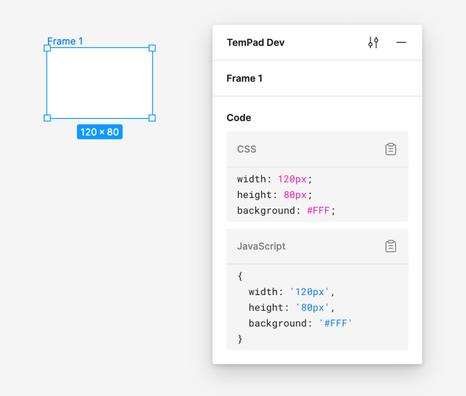
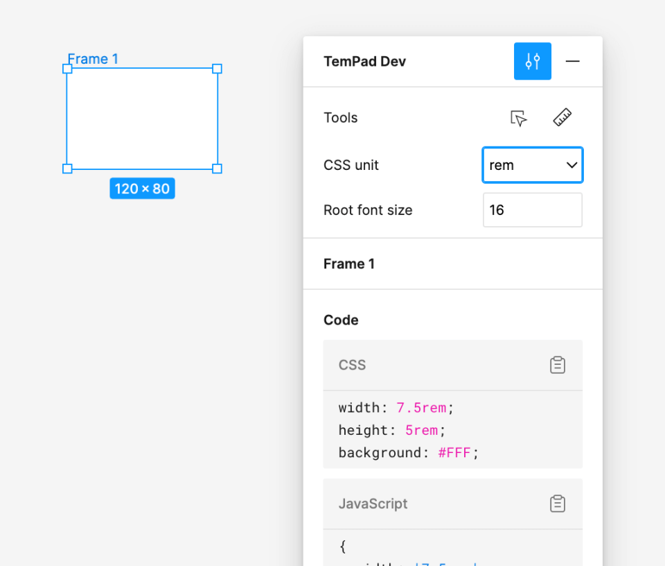
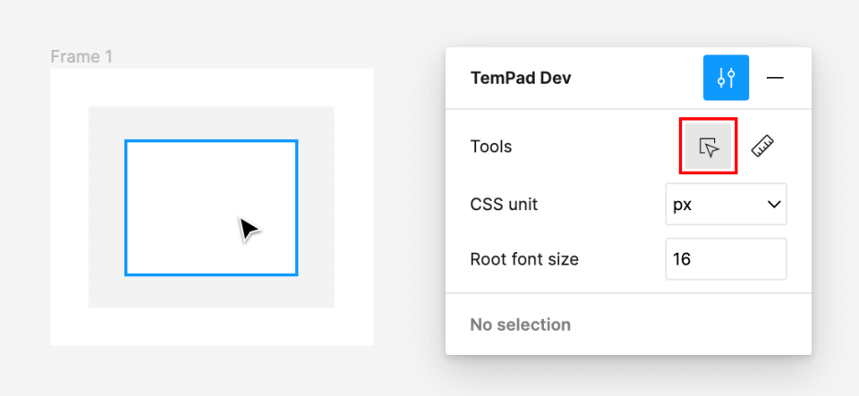
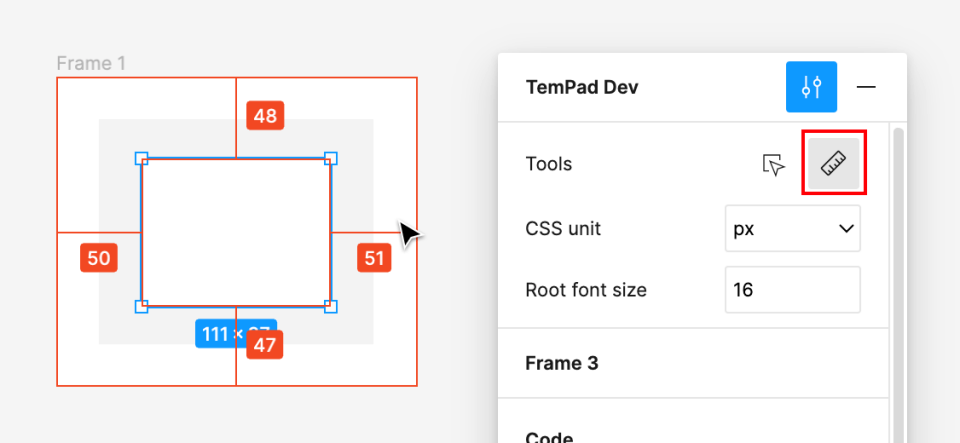
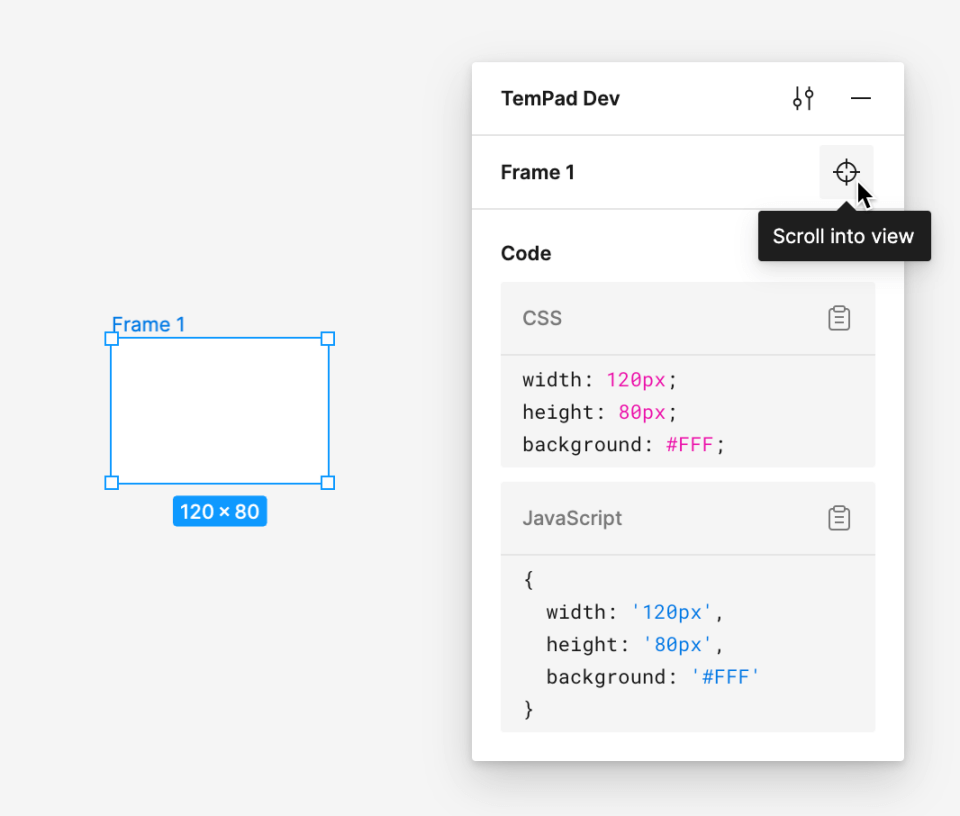
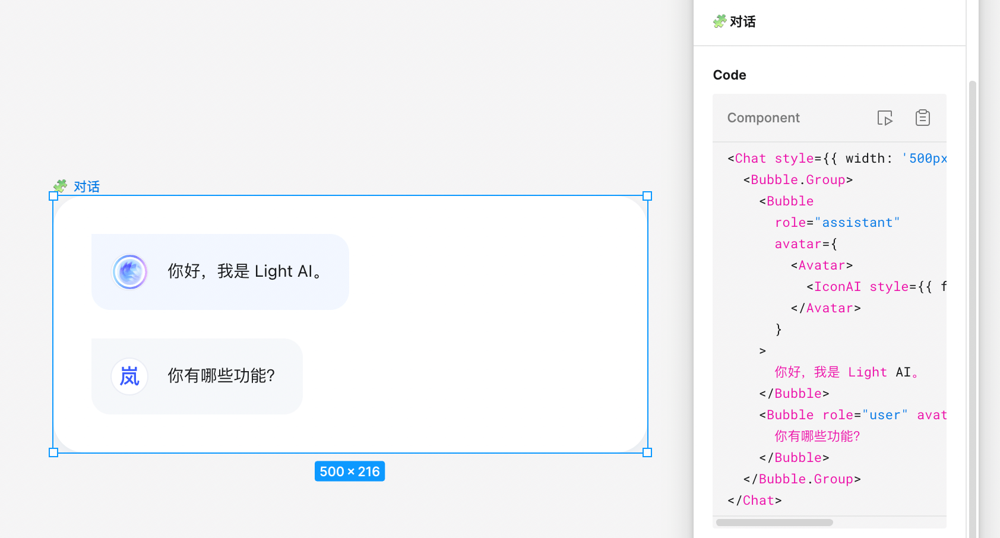

<h1 align="center">TemPad Dev</h1>

Inspect panel on Figma, for <b>everyone</b>.

  
  

<picture align="center" height="469">
  <source media="(prefers-color-scheme: dark)" src="assets/dark.png">
  <source media="(prefers-color-scheme: light)" src="assets/light.png">
  
</picture>

---

<h3>Compatibility Updates</h3>

**2024.03.19**: Figma removed the `window.figma` interface in view-only mode. As a result, we can no longer seamlessly view information and code for Figma elements in view-only mode.

**2024.03.20**: After we posted complaints on the Figma Community Forum, the Figma team stated that they would reinstate the `window.figma` interface in view-only mode in the coming weeks. You can track the progress of this issue on this [thread](https://forum.figma.com/t/figma-removed-window-figma-on-view-only-pages-today/67292).

**2024.04.03**: The Figma team adjusted the expected time from "in the coming weeks" to "in the coming months", effectively shelving the issue.

**2024.04.08**: TemPad Dev successfully retrieved most style information using currently unblocked debug interfaces, providing a new [Quirks Mode](#quirks-mode). This mode does not rely on `window.figma` but instead parses debug logs to generate style code, with slight differences from the standard mode.

**2024.11.04**: TemPad Dev now managed to bring back the `window.figma` API under view-only mode. But we still cannot guarantee the long-term validity of this feature. If Figma removes the related interface again, this mode will also become unavailable.

## Key features

### Inspect CSS code

Select any element, and you can obtain the CSS code through the plugin's Code panel. In addition to standard CSS code, TemPad Dev also provides styles in the form of JavaScript objects, making it convenient for use in JSX and similar scenarios.

You can configure CSS units and root font size to convert px dimensions in CSS to rem units.

> ![WARNING]
> After switching units, only the code output in the TemPad Dev panel will switch to non-px units. The plugin cannot affect the display of sizes and spacing on the Figma canvas.

### Deep select mode

In Figma's read-only view, selecting nodes requires double-clicking to drill down, and it often takes repeated double-clicks to select the lowest-level node. Although Figma offers a <kbd>⌘</kbd> + click shortcut, many users are unaware of this feature and need to perform extra key operations each time. Therefore, TemPad Dev provides a deep select mode in the settings.

### Measure to selection mode

In Figma's read-only view, you need to hold <kbd>⌥</kbd> and move the cursor to display the spacing between other nodes and the selected node. For similar reasons to the deep select mode, TemPad Dev provides a measure to selection mode in the settings.

### Scroll selection into view

When you hover over a node name section in TemPad Dev's inspect panel, a corresponding button appears. Clicking it will scroll the current selection to the center of the Figma viewport. Figma has a similar <kbd>⇧2</kbd> shortcut, but it zooms in to fill the viewport, which often doesn't meet the needs. Figma actually exposes an interface in the plugin API to move and zoom to 100%, so we also provide this capability as a supplement.

<h3>Inspect TemPad component code</h3>

> [!WARNING]
> This feature only works with nodes produced by the TemPad Figma plugin, which is only available internally at _Baidu, Inc._ at the moment.

Currently this feature only supports Light Design components.

If there are components generated by the TemPad Figma plugin on the canvas, TemPad Dev can directly output the component's invocation code in the Code panel. You can also quickly jump to the TemPad Playground to preview and debug the runnable code.

## Quirks mode

> [!NOTE]
> New in v0.1.0

Starting from TemPad Dev v0.1.0, a Quirks Mode is added, allowing use without relying on `window.figma`. In this mode, style codes are parsed through Figma's debug log information, slightly different from the information read directly through the Plugin API (`window.figma`) in standard mode. Known missing features generating style codes include:

- Styles added through Effects, corresponding to CSS properties like `box-shadow`, `filter: blur()`, and `backdrop-filter: blur()`.
- Gradient fill styles. TemPad Dev can only detect the existence of a gradient and outputs it as `linear-gradient(<color-stops>)`.
- Fill styles' blend mode, corresponding to the `background-blend-mode` CSS property.
- `font-family` of text nodes, which is obtained heuristically and may be inaccurate.
- Advanced OpenType configurations for text nodes, other than numeric styles, which are generally not used.
- The ["Scroll Selection into View"](#scroll-selection-into-view) feature is not available in this mode.

Except for the above-mentioned features, others are mostly consistent with the standard mode. If Quirks mode is sufficient for your scenarios, it can eliminate the tedious operation of duplicating to drafts and be used directly in view-only mode. Note that this mode also relies on Figma's globally exposed debug interface and cannot guarantee long-term validity. If Figma removes the related interface again, this mode will also become unavailable.

## Acknowledgements

Built with [WXT](https://wxt.dev/), TypeScript and Vue 3.

Inspired by the following projects:

- https://github.com/leadream/figma-viewer-chrome-plugin
- https://github.com/zouhangwithsweet/fubukicss-tool
- https://github.com/Inclushe/figma-ui3
