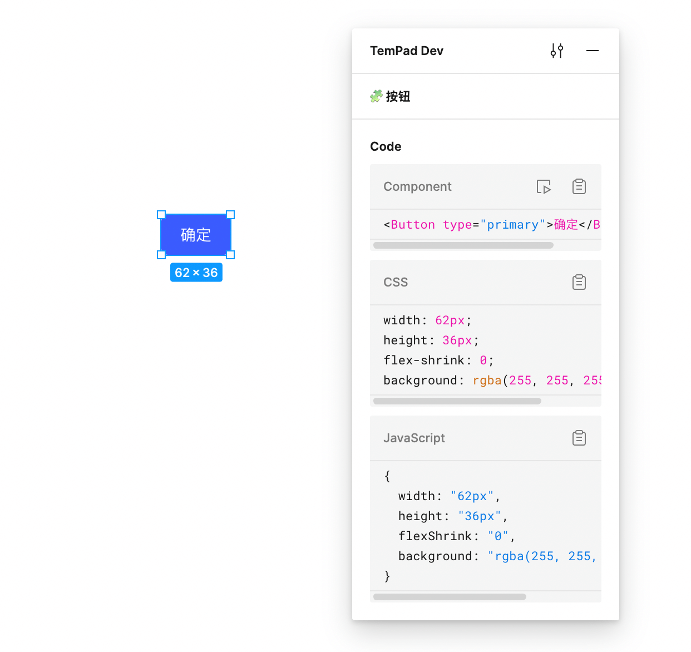

# TemPad Dev

Inspect panel on Figma, for everyone.

Built with [WXT](https://wxt.dev/), TypeScript and Vue 3.

  <picture>
    <source media="(prefers-color-scheme: dark)" srcset="assets/dark.png 2x">
    <source media="(prefers-color-scheme: light)" srcset="assets/light.png 2x">
    
  </picture>

## Features

Currently supported features include:

- Viewing/copying the CSS code of the selected node
- Viewing/copying the JavaScript form of the CSS code of the selected node
- Viewing/copying the component code of the selected component (inputted through the TemPad Figma plugin), with the ability to jump to the TemPad Playground for preview/debugging
- Locking the Deep Select mode (originally requiring pressing <kbd>⌘</kbd> and clicking)
- Locking the Measure to Selection mode (originally requiring moving the cursor while holding <kbd>⌥</kbd> to view)
- Scrolling the selected elements back into the viewport
- Toggling CSS units between `px` and `rem` (supports setting root font size)

## Acknowledgements

Inspired by the following projects:

- https://github.com/leadream/figma-viewer-chrome-plugin
- https://github.com/zouhangwithsweet/fubukicss-tool
