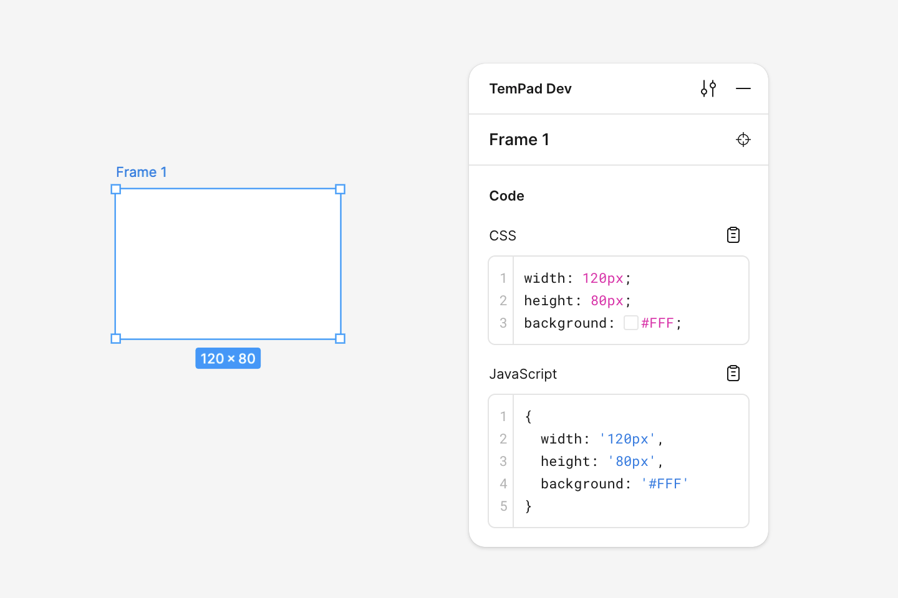
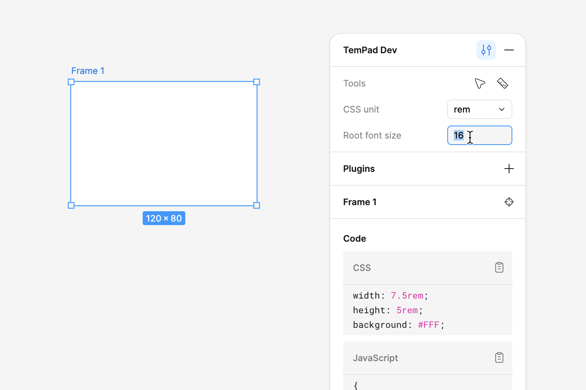
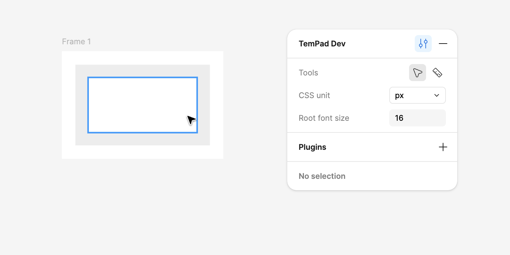
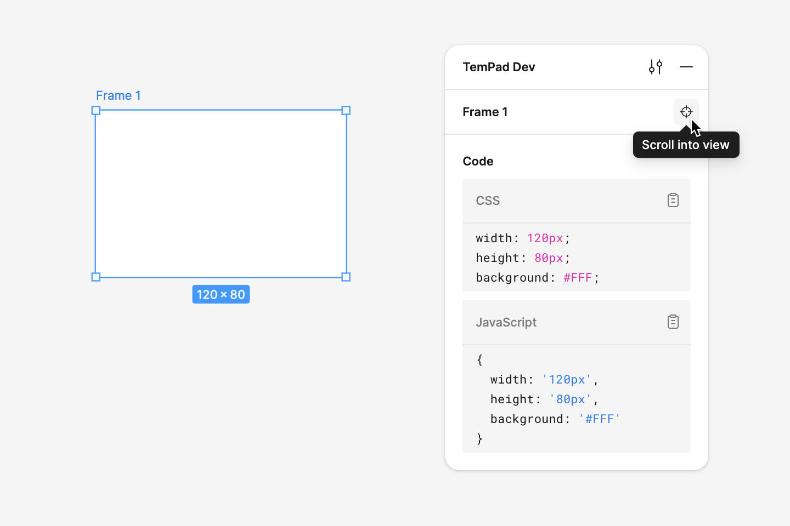
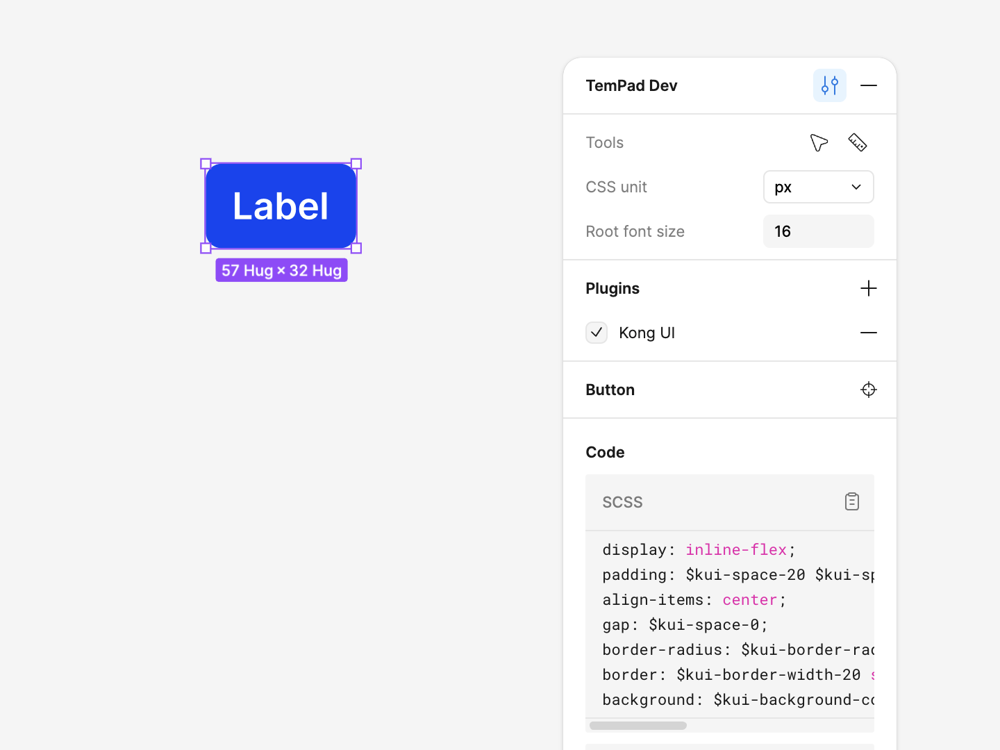
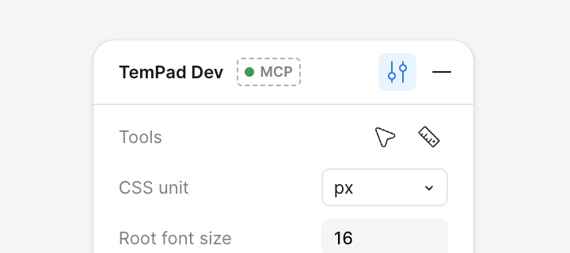
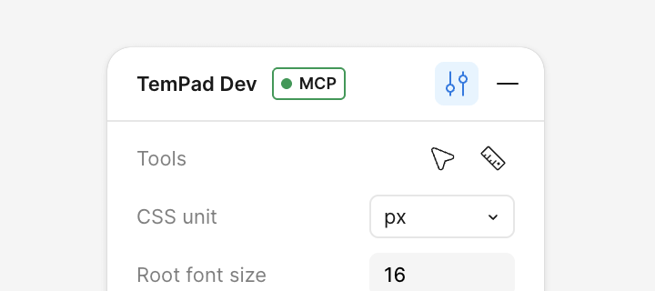

<p align="center">
  <picture>
    <source media="(prefers-color-scheme: dark)" srcset="packages/extension/assets/hero-dark.svg">
    <source media="(prefers-color-scheme: light)" srcset="packages/extension/assets/hero-light.svg">
    
  </picture>
</p>

<p align="center">面向 <b>所有人</b> 的 Figma Inspect 面板。</p>

<p align="center">
  <a href="https://chrome.google.com/webstore/detail/tempad-dev/lgoeakbaikpkihoiphamaeopmliaimpc"></a>
  <a href="https://discord.gg/MXGXwtkEck"></a>
</p>

<p align="center">
  <a href="https://github.com/ecomfe/tempad-dev/actions/workflows/build.yml"></a>
  <a href="https://github.com/ecomfe/tempad-dev/actions/workflows/check-rewrite.yml"></a>
</p>

<p align="center">
  <picture>
    <source media="(prefers-color-scheme: dark)" srcset="packages/extension/assets/code-dark.png">
    <source media="(prefers-color-scheme: light)" srcset="packages/extension/assets/code-light.png">
    
  </picture>
</p>

---

## 主要功能

### 查看 CSS 代码

<picture>
  <source media="(prefers-color-scheme: dark)" srcset="packages/extension/assets/code-dark.png">
  <source media="(prefers-color-scheme: light)" srcset="packages/extension/assets/code-light.png">
  
</picture>

选择任意元素后，你可以在插件的 Code 面板中获取对应的 CSS 代码。除了标准的 CSS 代码之外，TemPad Dev 还会以 JavaScript 对象的形式提供样式，方便在 JSX 等场景中直接使用。

<picture>
  <source media="(prefers-color-scheme: dark)" srcset="packages/extension/assets/unit-dark.png">
  <source media="(prefers-color-scheme: light)" srcset="packages/extension/assets/unit-light.png">
  
</picture>

你可以配置 CSS 单位和根字体大小，将 CSS 中的 `px` 尺寸转换为 `rem`。同时也可以设置 `scale` 系数，根据实际交付需求对 `px` 数值进行缩放。

> [!WARNING]
> 切换单位只会影响 TemPad Dev 面板中的输出，不会影响 Figma 画布本身。

### 深度选择模式

<picture>
  <source media="(prefers-color-scheme: dark)" srcset="packages/extension/assets/deep-dark.png">
  <source media="(prefers-color-scheme: light)" srcset="packages/extension/assets/deep-light.png">
  
</picture>

在 Figma 的只读视图中，选择节点通常需要不断双击逐层下钻，才能选中最底层的节点。虽然 Figma 提供了 <kbd>⌘</kbd> + 单击 的快捷方式，但很多用户并不知道这一功能，每次都需要额外的键盘操作。为此，TemPad Dev 在偏好设置中提供了深度选择模式。

### 测量到选中项模式

<picture>
  <source media="(prefers-color-scheme: dark)" srcset="packages/extension/assets/measure-dark.png">
  <source media="(prefers-color-scheme: light)" srcset="packages/extension/assets/measure-light.png">
  
</picture>

在 Figma 的只读视图中，需要按住 <kbd>⌥</kbd> 并移动鼠标，才能显示其他节点与当前选中节点之间的间距。基于与深度选择模式类似的考虑，TemPad Dev 也在偏好设置中提供了测量到选中项模式。

### 将选中项滚动到视图中

<picture>
  <source media="(prefers-color-scheme: dark)" srcset="packages/extension/assets/scroll-dark.png">
  <source media="(prefers-color-scheme: light)" srcset="packages/extension/assets/scroll-light.png">
  
</picture>

当你在 TemPad Dev 的 Inspect 面板中将鼠标悬停在节点名称区域时，会出现一个按钮。点击后，当前选中的节点会被滚动到 Figma 视口的正中央。Figma 也提供了类似的 <kbd>⇧2</kbd> 快捷键，但该操作会放大并填满视口，往往不符合实际需求。Figma 的插件 API 实际上提供了在保持 100% 缩放的情况下移动视图的接口，因此我们也将这一能力作为补充提供了出来。

---

### 插件

<picture>
  <source media="(prefers-color-scheme: dark)" srcset="packages/extension/assets/plugins-dark.png">
  <source media="(prefers-color-scheme: light)" srcset="packages/extension/assets/plugins-light.png">
  
</picture>

插件可以用来自定义内置的代码输出，或添加自定义的代码块。

一个 TemPad Dev 插件本质上是一个简单的 JavaScript 文件，通过 `default` 导出或名为 `plugin` 的命名导出暴露插件对象。要安装插件，只需将插件文件的 URL 粘贴到 _Preferences > Plugins_ 中即可。一些内置插件也可以通过 `@{name}` 语法启用，例如 `@foo`，它对应的是我们 [插件注册表](https://github.com/ecomfe/tempad-dev/blob/main/packages/extension/plugins/available-plugins.json) 中的插件名称。

> [!NOTE]
> 插件代码存储在浏览器的本地存储中，不支持版本管理或自动更新，需要你在 UI 中手动更新。

#### 创建插件

使用 `@tempad-dev/plugins` 包中提供的、带完整类型定义的 `definePlugin` 函数，可以简化插件的创建过程。

```sh
npm install -D @tempad-dev/plugins # 或 pnpm add -D @tempad-dev/plugins
```

下面是一个简单的示例插件，它会覆盖内置的 CSS 代码块，并隐藏 JavaScript 代码块：

```ts
import { definePlugin } from '@tempad-dev/plugins'

export default definePlugin({
  name: 'My Plugin',
  code: {
    css: {
      title: 'Stylus', // 自定义代码块标题
      lang: 'stylus', // 自定义语法高亮语言
      transform({ style }) {
        return Object.entries(style)
          .map(([key, value]) => `${key} ${value}`)
          .join('\n')
      }
    },
    js: false // 隐藏内置的 JavaScript 代码块
  }
})
```

更完整的示例可以参考 [Justineo/tempad-dev-plugin-kong](https://github.com/Justineo/tempad-dev-plugin-kong/)。

> [!NOTE]
> 插件文件必须是合法的 ES Module，并且需要通过 `default` 导出或 `plugin` 命名导出插件对象。

目前我们支持 4 种插件钩子：

- `transform`：将样式对象或代码转换为字符串形式，用于代码块输出。适合用于 Tailwind CSS、UnoCSS 等自定义结构。
- `transformVariable`：将 CSS 变量转换为其他格式，例如转换为 Sass 变量以用于设计令牌。
- `transformPx`：将像素值转换为其他单位或按比例缩放。
- `transformComponent`：将设计组件对象转换为开发侧的组件对象或字符串，用于生成设计系统的组件代码。

> [!TIP]
> 如果希望在生成的 CSS 中包含 JavaScript 变量，可以使用 `\0` 字符包裹变量名。这样会被转换为 JavaScript 的字符串插值。
> 例如返回 `\0foo\0`，则输入 `calc(var(--foo) + 10px)` 会被转换为 `` `calc(${foo} + 10px)` ``。

此外，你还可以为代码块指定自定义的 `title` 和 `lang`，或者将内置代码块设置为 `false` 以隐藏它。

完整的类型定义和辅助函数请参见 [`packages/plugins/src/index.ts`](./packages/plugins/src/index.ts)。

#### 部署插件

请确保你的插件可以通过支持跨域请求的 URL 访问，例如托管在 GitHub 仓库或 Gist 中。比如可以使用 raw 地址：

```text
https://raw.githubusercontent.com/{username}/{repo}/refs/heads/{branch}/{filename}.js
```

> [!NOTE]
> 插件 URL 必须支持跨域请求。GitHub 或 Gist 提供的 raw URL 通常是可用的。

插件运行在 Web Worker 中，不会阻塞主线程，也无法访问 DOM，从而保证性能和安全性。插件上下文中只提供了有限的全局变量，具体可参考 [`packages/extension/codegen/safe.ts`](./packages/extension/codegen/safe.ts)。

#### 分享插件

你也可以将插件注册到我们的 [插件注册表文件](https://github.com/ecomfe/tempad-dev/blob/main/packages/extension/plugins/available-plugins.json) 中，这样就可以通过插件名直接安装。

**欢迎来 [添加你自己的精彩插件](https://github.com/ecomfe/tempad-dev/edit/main/packages/extension/plugins/available-plugins.json)！**

当前可用插件列表：

<!-- prettier-ignore-start -->
<!-- availablePlugins:start -->
| 插件名称 | 描述 | 作者 | 仓库 |
| -- | -- | -- | -- |
| `@kong` | Kong Design System | [@Justineo](https://github.com/@Justineo) |  [GitHub](https://github.com/Justineo/tempad-dev-plugin-kong) |
| `@kong/advanced` | Kong Design System（高级版） | [@Justineo](https://github.com/@Justineo) |  [GitHub](https://github.com/Justineo/tempad-dev-plugin-kong) |
| `@fubukicss/unocss` | FubukiCSS 的 UnoCSS | [@zouhangwithsweet](https://github.com/@zouhangwithsweet) |  [GitHub](https://github.com/zouhangwithsweet/fubukicss-tool) |
| `@nuxt` | Nuxt UI | [@Justineo](https://github.com/@Justineo) |  [GitHub](https://github.com/Justineo/tempad-dev-plugin-nuxt-ui) |
| `@nuxt/pro` | Nuxt UI Pro | [@Justineo](https://github.com/@Justineo) |  [GitHub](https://github.com/Justineo/tempad-dev-plugin-nuxt-ui) |
| `@baidu-health/wz-style` | 百度健康 wz-style 自定义样式 | [@KangXinzhi](https://github.com/@KangXinzhi) |  [GitHub](https://github.com/KangXinzhi/tempad-dev-plugin-wz-style) |
| `@baidu-health/med-style` | 百度健康 med-style 自定义样式 | [@KangXinzhi](https://github.com/@KangXinzhi) |  [GitHub](https://github.com/KangXinzhi/tempad-dev-plugin-med-style) |
| `@tailwind` | CSS 转 Tailwind CSS | [@haydenull](https://github.com/@haydenull) |  [GitHub](https://github.com/haydenull/tempad-dev-plugin-tailwind) |
| `@react-native` | CSS 转 React Native StyleSheet | [@CANntyield](https://github.com/@CANntyield) |  [GitHub](https://github.com/CANntyield/tempad-dev-plugin-react-native) |
<!-- availablePlugins:end -->
<!-- prettier-ignore-end -->

## MCP 服务器

TemPad Dev 内置了一个 [MCP](https://modelcontextprotocol.io/) 服务器，使得 Agent 或 IDE 可以直接从你在 Figma 中选中的节点拉取代码和上下文。在打开 TemPad Dev 面板并启用 MCP 后，服务器会暴露以下能力：

- `get_code`：默认输出高保真的 JSX/Vue + TailwindCSS 代码，同时包含相关资源以及使用的 codegen 预设和配置。
- `get_structure`：当前选中节点的结构信息（id、类型、几何数据）。
- `get_screenshot`：PNG 截图，包含 `resourceUri` 以及可直接下载的 HTTP URL。
- `tempad-assets` 资源模板（`asset://tempad/{hash}`），用于访问上述工具返回的二进制资源。

### 配置指南

<picture>
  <source media="(prefers-color-scheme: dark)" srcset="packages/extension/assets/mcp-config-dark.png">
  <source media="(prefers-color-scheme: light)" srcset="packages/extension/assets/mcp-config-light.png">
  
</picture>

1. **前置条件**：Node.js 18+，并且在 Figma 标签页中运行 TemPad Dev。
2. 在 TemPad Dev 中打开 **Preferences → MCP server**，然后启用 **Enable MCP server**。
3. 使用偏好设置中的快捷操作进行安装和连接，或在你的 MCP 客户端中手动添加一个 stdio 命令形式的服务器：

   ```json
   {
     "mcpServers": {
       "TemPad Dev": {
         "command": "npx",
         "args": ["-y", "@tempad-dev/mcp@latest"]
       }
     }
   }
   ```

   如果你的客户端使用 CLI 安装器，以下命令效果等同：
   - `claude mcp add --transport stdio "TemPad Dev" -- npx -y @tempad-dev/mcp@latest`
   - `codex mcp add "TemPad Dev" -- npx -y @tempad-dev/mcp@latest`

4. 使用 MCP 时，请保持 TemPad Dev 标签页处于激活状态。如果同时打开了多个 Figma 文件（也就有多个 TemPad Dev 实例），可以点击 TemPad Dev 面板中的 MCP 徽标，激活对应文件的 MCP（这会同时停用其他标签页中的 MCP）。

### MCP 连接状态

启用 MCP 后，TemPad Dev 面板标题栏中会显示一个徽标，表示当前的连接状态：

- **Unavailable**：本地 MCP 服务器未配置或未运行。

  <picture>
    <source media="(prefers-color-scheme: dark)" srcset="packages/extension/assets/mcp-unavailable-dark.png">
    <source media="(prefers-color-scheme: light)" srcset="packages/extension/assets/mcp-unavailable-light.png">
    
  </picture>

- **Inactive**：TemPad Dev 已连接到本地 MCP 服务器，但由于打开了多个 Figma 标签页，此标签页当前未激活。点击徽标即可为当前标签页激活 MCP（同时会停用其他标签页的 MCP）。

  <picture>
    <source media="(prefers-color-scheme: dark)" srcset="packages/extension/assets/mcp-inactive-dark.png">
    <source media="(prefers-color-scheme: light)" srcset="packages/extension/assets/mcp-inactive-light.png">
    
  </picture>

- **Active**：MCP 服务器正在运行，并且当前标签页已激活，可随时响应 MCP 工具调用。

  <picture>
    <source media="(prefers-color-scheme: dark)" srcset="packages/extension/assets/mcp-active-dark.png">
    <source media="(prefers-color-scheme: light)" srcset="packages/extension/assets/mcp-active-light.png">
    
  </picture>

### 配置项

`@tempad-dev/mcp` 支持以下可选环境变量：

- `TEMPAD_MCP_TOOL_TIMEOUT`（默认 `15000`）：工具调用超时时间，单位为毫秒。
- `TEMPAD_MCP_AUTO_ACTIVATE_GRACE`（默认 `1500`）：在只有一个扩展连接时，自动激活前的延迟时间。
- `TEMPAD_MCP_MAX_ASSET_BYTES`（默认 `8388608`）：捕获的资源或截图允许的最大上传大小（字节）。
- `TEMPAD_MCP_RUNTIME_DIR`（默认 `${TMPDIR}/tempad-dev/run`）：Hub 存储 socket 与锁文件的目录。
- `TEMPAD_MCP_LOG_DIR`（默认 `${TMPDIR}/tempad-dev/log`）：MCP 日志目录。
- `TEMPAD_MCP_ASSET_DIR`（默认 `${TMPDIR}/tempad-dev/assets`）：用于存储导出资源的目录，这些资源会通过 `resourceUri` 引用。

<details>
<summary><h3>查看 TemPad 组件代码</h3></summary>

> 该功能仅适用于由 TemPad Figma 插件生成的节点，而该插件目前仅在 _百度_ 内部可用。

目前此功能仅支持 Light Design 组件。

如果画布中存在由 TemPad Figma 插件生成的组件，TemPad Dev 可以在 Code 面板中直接输出该组件的调用代码。你也可以快速跳转到 TemPad Playground，对可运行的代码进行预览和调试。

</details>

<details>
<summary><h2><a id="quirks-mode"></a>Quirks 模式</h2></summary>

> [!CAUTION]
> 自 2025.04.01 起，Quirks 模式已不可用。Figma 移除了用于提取样式数据的 `window.DebuggingHelpers.logSelected` API。

> [!NOTE]
> TemPad Dev v0.1.0 新增

Quirks 模式是在 TemPad Dev v0.1.0 中引入的，当 `window.figma` 不可用时，你仍然可以使用该工具。该模式通过解析 Figma 的调试日志来提取样式数据，从而生成基础样式代码，但会存在一定限制。

当前已知无法生成或存在差异的功能包括：

- Effects 中添加的样式，对应的 CSS 属性如 `box-shadow`、`filter: blur()`、`backdrop-filter: blur()`。
- 渐变填充样式。TemPad Dev 只能检测到渐变的存在，并输出为 `linear-gradient(<color-stops>)`。
- 填充样式的混合模式，对应 CSS 的 `background-blend-mode`。
- 文本节点的 `font-family`，该值通过启发式方式获取，可能不准确。
- 除数字样式之外的高级 OpenType 配置，通常在实际中较少使用。
- [“将选中项滚动到视图中”](#scroll-selection-into-view) 功能在该模式下不可用。

除上述限制外，其余功能与标准模式基本一致。如果 Quirks 模式能够满足你的使用场景，就可以避免复制到草稿文件等繁琐操作，直接在只读视图中使用。但需要注意的是，该模式同样依赖于 Figma 全局暴露的调试接口，无法保证长期可用性。如果 Figma 再次移除相关接口，该模式也会随之失效。

<details>
<summary><h3>兼容性更新</h3></summary>

**2025.04.01**：Figma 移除了用于提取样式数据的 `window.DebuggingHelpers.logSelected` API，Quirks 模式因此不可用。

**2024.11.04**：TemPad Dev 成功在只读模式下重新获取了 `window.figma` API，但仍无法保证该能力的长期有效性。如果 Figma 再次移除相关接口，该模式也将不可用。

**2024.04.08**：TemPad Dev 通过当前尚未被封禁的调试接口，成功获取了大部分样式信息，并引入了新的 [Quirks 模式](#quirks-mode)。该模式不依赖 `window.figma`，而是通过解析调试日志生成样式代码，与标准模式存在少量差异。

**2024.03.20**：在我们向 Figma 社区论坛提交反馈后，Figma 团队表示将在未来几周内恢复只读模式下的 `window.figma` 接口。你可以在这个 [讨论帖](https://forum.figma.com/t/figma-removed-window-figma-on-view-only-pages-today/67292) 中跟踪该问题的进展。

</details>

</details>

## 致谢

使用 [WXT](https://wxt.dev/)、TypeScript 和 Vue 3 构建。

灵感来源于以下项目：

- <https://github.com/leadream/figma-viewer-chrome-plugin>
- <https://github.com/zouhangwithsweet/fubukicss-tool>
- <https://github.com/Inclushe/figma-ui3>
