<p align="center">
  <picture>
    <source media="(prefers-color-scheme: dark)" srcset="packages/site/public/marketing/hero-dark.svg">
    <source media="(prefers-color-scheme: light)" srcset="packages/site/public/marketing/hero-light.svg">
    
  </picture>
</p>

<p align="center">连接 Figma、开发者和 coding agent 的开放工具</p>

<p align="center">
  <a href="https://chrome.google.com/webstore/detail/tempad-dev/lgoeakbaikpkihoiphamaeopmliaimpc"></a>
  <a href="https://discord.gg/MXGXwtkEck"></a>
  <a href="https://deepwiki.com/ecomfe/tempad-dev"></a>
</p>

<p align="center">
  <a href="https://github.com/ecomfe/tempad-dev/actions/workflows/build.yml"></a>
  <a href="https://github.com/ecomfe/tempad-dev/actions/workflows/check-rewrite.yml"></a>
</p>

TemPad Dev 是连接 Figma、开发者和 coding agent 的开源工具。你可以直接在浏览器里检查设计、定制代码输出，也可以让 agent 读取设计、创建和修改原生 Figma 内容，并结合项目实现 UI。

## 目录

- [快速开始](#快速开始)
- [Agent 集成](#agent-集成)：[画布设计](#创建和修改-figma-设计)、[代码实现](#根据设计实现代码)、[配置指南](#配置指南)、[连接状态](#mcp-连接状态)
- [检查设计](#检查设计)：[CSS 与变量](#查看-css-代码)、[深度选择](#深度选择模式)、[测量](#测量到选中项模式)、[定位](#将选中项滚动到视图中)
- [输出插件](#输出插件)：安装、开发与分享

## 快速开始

1. 从 [Chrome Web Store](https://chromewebstore.google.com/detail/tempad-dev/lgoeakbaikpkihoiphamaeopmliaimpc) 安装 TemPad Dev，打开 Figma Design 文件。
2. 选中设计中的元素，在 TemPad Dev 面板查看代码、变量和布局信息。手动检查无需配置 agent。
3. 如需使用 coding agent，启用 **Preferences → Agent integration → MCP access**，点击 **Set up agents**，按所选客户端的说明安装。

Agent 连接需要 Node.js 22.x、24.x 或 26+；画布编辑还需要当前 Figma Design 文件的编辑权限。扩展、MCP server 和两个 skill 的配置与升级说明见下文。

## Agent 集成

通过你已经在使用的 coding agent 或 IDE 处理 Figma 设计。TemPad Dev 提供设计信息和画布操作，agent 结合你的要求与项目上下文完成工作。

### 创建和修改 Figma 设计

在 Figma 中创建界面、调整布局和文字，或修改已有设计。结果由原生、可编辑的图层构成；任务需要时，可以复用可访问的组件、变量和样式。

例如，在连接好 agent 后提出：

> 在 Figma 中使用可访问的组件创建一个设置页面。

也可以选中已有设计后提出：

> 调整这个页面的间距和文字层级，保留现有组件和内容。

`figma-canvas-authoring` skill 指导 agent 检查相关资源、执行修改并检查实际渲染结果。写入需要可编辑的 Figma Design 文件；只读文件和 Dev Mode 中的访问仍然是只读的。

### 根据设计实现代码

在 Figma 中选中要实现的设计，在目标代码项目中提出：

> 根据当前 Figma 选区实现 UI，使用这个项目已有的组件和样式约定。

TemPad Dev 提供布局、样式、变量引用、组件信息和素材。`figma-design-to-code` skill 指导 agent 结合仓库实现界面，完成验证。生成的设计代码是实现起点，最终代码由 agent 适配项目。

这两个工作流通过同一个 MCP 连接访问 Figma。兼容客户端可以安装包含 MCP 配置和两个 skill 的 [Agent Plugin](./agent-plugins/tempad-dev/README.zh-Hans.md)；其它客户端可以分别配置 MCP 和 skill。

### 配置指南

<picture>
  <source media="(prefers-color-scheme: dark)" srcset="packages/site/public/marketing/mcp-config-dark.png">
  <source media="(prefers-color-scheme: light)" srcset="packages/site/public/marketing/mcp-config-light.png">
  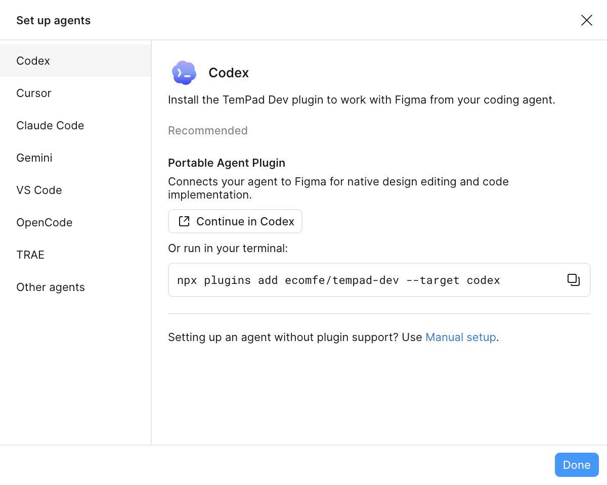
</picture>

1. 安装 Node.js 22.x、24.x 或 26+ 并确保 `npx` 可用。在希望 agent 检查的 Figma 标签页中保持 TemPad Dev 打开，然后启用 **Preferences → Agent integration → MCP access**。出现提示时，请允许连接到 loopback 地址 `127.0.0.1`。启用 MCP access 且当前 Figma Design 文件可编辑时，即可进行画布创作。
2. 点击 **Set up agents**，选择 Codex、Cursor、Claude Code、Gemini、VS Code、OpenCode 或 TRAE，然后按界面显示的路径配置。其它兼容客户端请选择 **Other**。这里的选择只会切换说明，不会绑定或激活 agent。
3. 对 Codex、Cursor、Claude Code 和 VS Code，配置流程会优先安装可移植的 Agent Plugin。对 Gemini、OpenCode、TRAE 及其它尚无兼容 plugin 安装能力的客户端，则使用对应客户端的 MCP 流程并单独安装两个 skill。所有命令和 config 都会完整显示，便于检查和复制。

以下以 Gemini 为例，展示分别配置 MCP 和两个 skill 的安装路径：

<picture>
  <source media="(prefers-color-scheme: dark)" srcset="packages/site/public/marketing/mcp-config-gemini-dark.png">
  <source media="(prefers-color-scheme: light)" srcset="packages/site/public/marketing/mcp-config-gemini-light.png">
  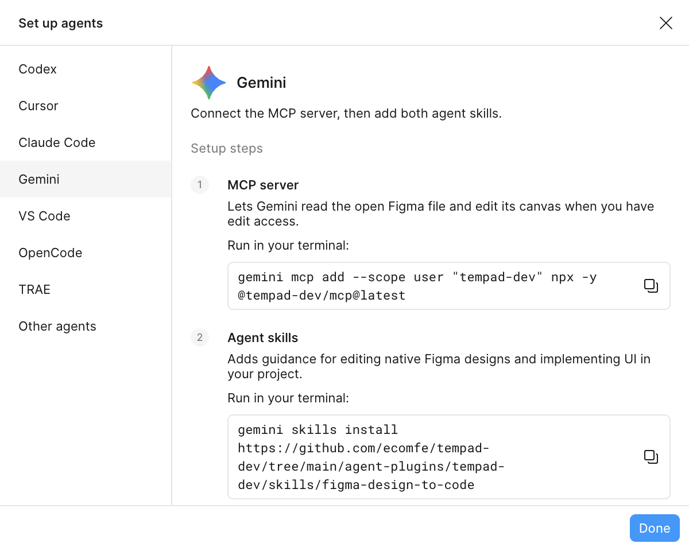
</picture>

向下滚动可查看两个 skill 的完整安装命令：

<picture>
  <source media="(prefers-color-scheme: dark)" srcset="packages/site/public/marketing/mcp-config-gemini-skills-dark.png">
  <source media="(prefers-color-scheme: light)" srcset="packages/site/public/marketing/mcp-config-gemini-skills-light.png">
  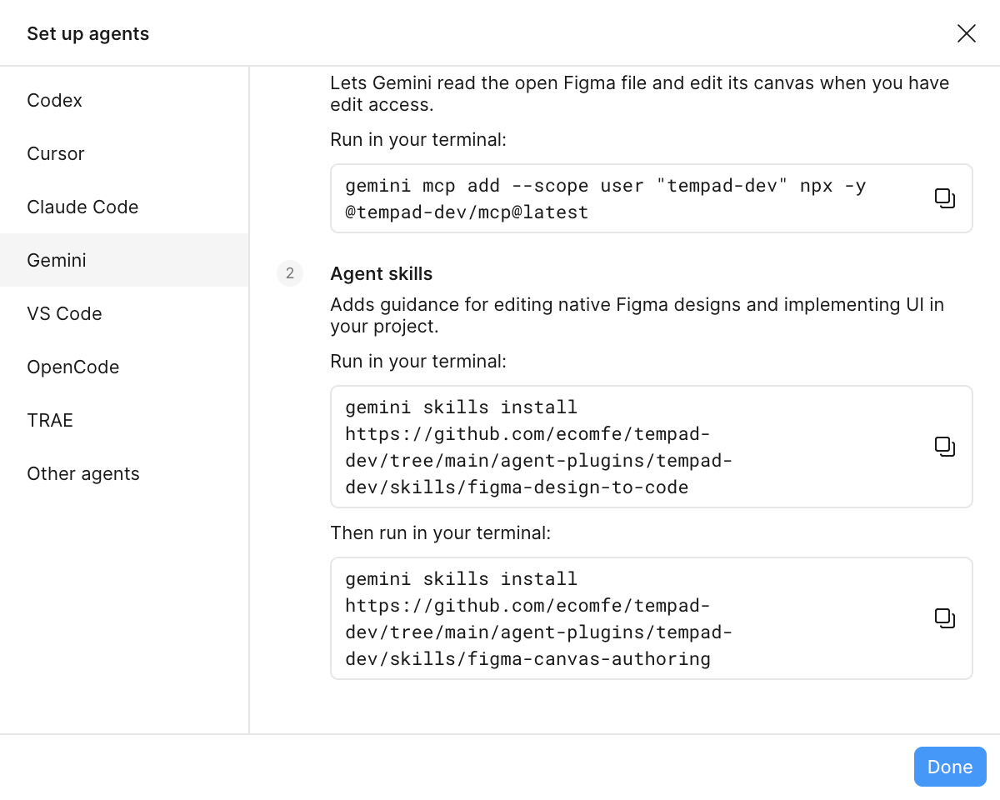
</picture>

要把可移植插件安装到本机检测到的所有兼容 agent，可运行：

```bash
npx plugins add ecomfe/tempad-dev
```

使用 `--target codex`、`--target cursor`、`--target claude-code` 或 `--target vscode` 可以只
安装到内置配置入口中的某一个目标。Codex 与 Claude 的原生 marketplace 命令，以及直接
安装 MCP 和 skill 的方式，仍作为兼容回退保留在
[Agent Plugin 指南](./agent-plugins/tempad-dev/README.zh-Hans.md)中。

所有 plugin 和直接使用 `npx` 的配置路径都使用 `@tempad-dev/mcp@latest`。

本次画布创作版本应配套使用扩展 **0.21.0**、MCP server **0.8.0** 和 Agent Plugin
**0.2.0**。更新既有安装时，请参阅 [升级指南](./agent-plugins/tempad-dev/README.zh-Hans.md#升级)。

使用期间请保持 TemPad Dev 打开并启用 MCP。如果连接了多个 Figma 文件，请点击目标文件面板中的 MCP 徽标；该文件会成为 agent 当前访问的上下文。

### MCP 连接状态

启用 MCP 服务器后，TemPad Dev 面板标题栏中会显示一个徽标，表示当前的连接状态：

- **Unavailable**：本地 MCP 服务器未配置或未运行。

  <picture>
    <source media="(prefers-color-scheme: dark)" srcset="packages/site/public/marketing/mcp-unavailable-dark.png">
    <source media="(prefers-color-scheme: light)" srcset="packages/site/public/marketing/mcp-unavailable-light.png">
    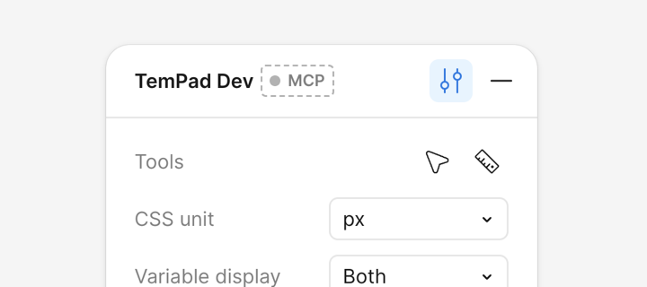
  </picture>

- **Inactive**：TemPad Dev 已连接到本地 MCP 服务器，但由于打开了多个 Figma 标签页，此标签页当前未激活。点击徽标即可为当前标签页激活 MCP（同时会停用其他标签页的 MCP）。

  <picture>
    <source media="(prefers-color-scheme: dark)" srcset="packages/site/public/marketing/mcp-inactive-dark.png">
    <source media="(prefers-color-scheme: light)" srcset="packages/site/public/marketing/mcp-inactive-light.png">
    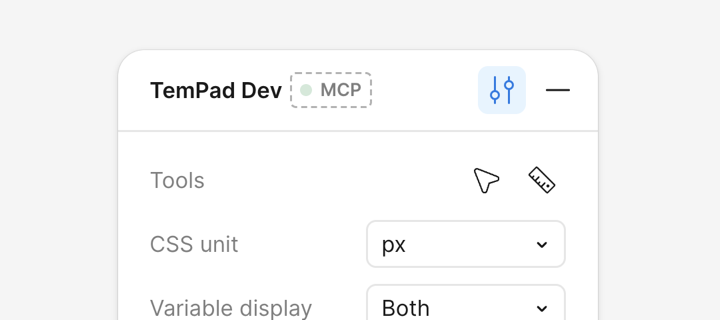
  </picture>

- **Active**：MCP 服务器正在运行，并且当前标签页已激活，可随时响应 MCP 工具调用。

  <picture>
    <source media="(prefers-color-scheme: dark)" srcset="packages/site/public/marketing/mcp-active-dark.png">
    <source media="(prefers-color-scheme: light)" srcset="packages/site/public/marketing/mcp-active-light.png">
    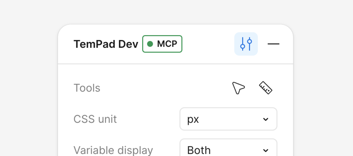
  </picture>

### 配置项

`@tempad-dev/mcp` 的环境变量配置请参见 [`packages/mcp-server/README.zh-Hans.md`](./packages/mcp-server/README.zh-Hans.md)。

### MCP 工具

以下工具供 agent 调用；日常使用可以直接描述任务。

- `get_code`：默认输出高保真的 JSX/Vue + TailwindCSS 代码，同时包含相关资源以及使用的 codegen 预设和配置。
- `get_design_system`：创建不可变、确定性的紧凑目录，按资源类型平衡分页返回可访问页面的
  组件定义，以及本地或被定义直接引用的变量、集合/模式、样式和 shader 定义；既不扫描
  画布中的使用情况，也不加载所有页面。游标可继续读取遗漏定义；使用同一目录精确查询
  某个引用时，返回该资源的有界定义。使用 `scope: "fonts"` 可查询当前可用字体家族和精确
  原生样式，不扫描文件资源。
- `apply_canvas`：对精确页面或托管根节点执行创建、更新、删除或激活。仅操作页面时可省略
  Canvas HTML；对精确托管根内既有稳定 key 的纯 native 更新也可省略。也可以直接把根节点写入
  非当前的精确目标页面，而不切换编辑器上下文。扩展会在本地解析、验证、计算与实时画布的
  差异、应用修改并校验结构。画布创作要求当前 Figma Design 文件具有编辑权限。
- `get_screenshot`：返回一张有大小限制的渲染 PNG，用于按需视觉验证。
- `get_structure`：精确节点、精确托管页面或当前选中节点的结构信息（id、类型、几何数据）。
- `upload_asset`：将生成的 PNG/JPEG/GIF 存入本地 Hub，并返回供画布创作使用的 `assetHash`。
- 二进制资源会通过工具响应中的元数据 + HTTP 下载地址（`asset.url`）提供；MCP 不再暴露 asset 资源模板。

---

<a id="主要功能"></a>

## 检查设计

### 查看 CSS 代码

<picture>
  <source media="(prefers-color-scheme: dark)" srcset="packages/site/public/marketing/code-dark.png">
  <source media="(prefers-color-scheme: light)" srcset="packages/site/public/marketing/code-light.png">
  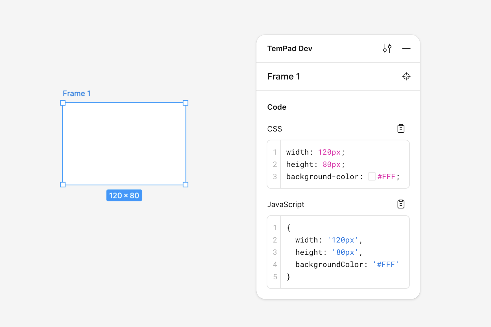
</picture>

选择元素后，你可以在扩展的 Code 面板中获取对应的 CSS 代码。除了标准的 CSS 代码之外，TemPad Dev 还会以 JavaScript 对象的形式提供样式，方便在 JSX 等场景中直接使用。

<picture>
  <source media="(prefers-color-scheme: dark)" srcset="packages/site/public/marketing/unit-dark.png">
  <source media="(prefers-color-scheme: light)" srcset="packages/site/public/marketing/unit-light.png">
  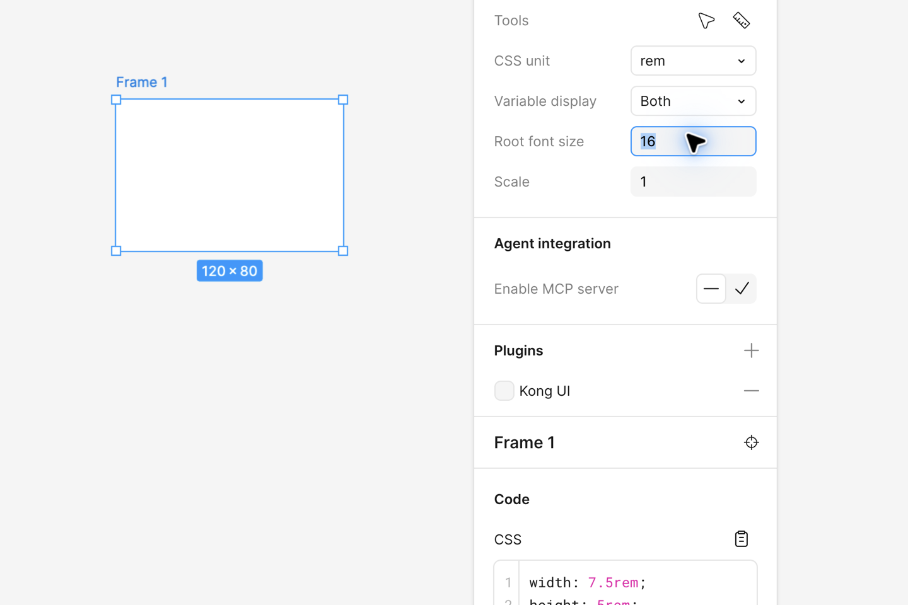
</picture>

你可以配置 CSS 单位和根字体大小，将 CSS 中的 `px` 尺寸转换为 `rem`。同时也可以设置 `scale` 系数，根据实际交付需求对 `px` 数值进行缩放。

在偏好设置里使用 **Variable display**（Reference/Resolved/Both）来选择代码输出展示变量引用、解析后的值，或两者同时显示。

当 Figma 变量定义了 `WEB codeSyntax` 时，Code 面板会原样保留这段由设计文件提供的语法。MCP `get_code` 仍会输出规范化的 CSS 变量引用，让 Agent 获得稳定的中间表示。

> [!WARNING]
> 切换单位只会影响 TemPad Dev 面板中的输出，不会影响 Figma 画布本身。

### 深度选择模式

<picture>
  <source media="(prefers-color-scheme: dark)" srcset="packages/site/public/marketing/deep-dark.png">
  <source media="(prefers-color-scheme: light)" srcset="packages/site/public/marketing/deep-light.png">
  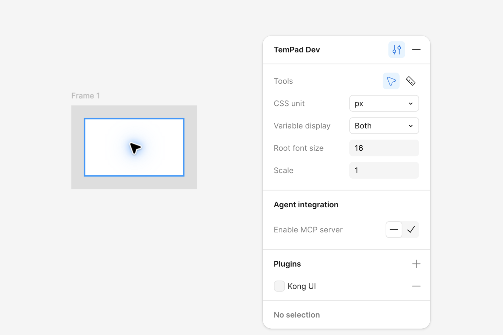
</picture>

在 Figma 的只读视图中，选择节点通常需要不断双击逐层下钻，才能选中最底层的节点。虽然 Figma 提供了 <kbd>⌘</kbd> + 单击 的快捷方式，但很多用户并不知道这一功能，每次都需要额外的键盘操作。为此，TemPad Dev 在偏好设置中提供了深度选择模式。

### 测量到选中项模式

<picture>
  <source media="(prefers-color-scheme: dark)" srcset="packages/site/public/marketing/measure-dark.png">
  <source media="(prefers-color-scheme: light)" srcset="packages/site/public/marketing/measure-light.png">
  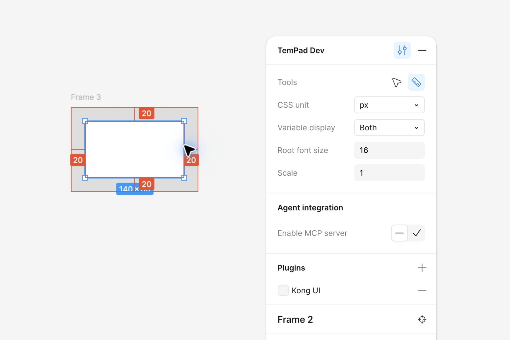
</picture>

在 Figma 的只读视图中，需要按住 <kbd>⌥</kbd> 并移动鼠标，才能显示其他节点与当前选中节点之间的间距。基于与深度选择模式类似的考虑，TemPad Dev 也在偏好设置中提供了测量到选中项模式。

### 将选中项滚动到视图中

<picture>
  <source media="(prefers-color-scheme: dark)" srcset="packages/site/public/marketing/scroll-dark.png">
  <source media="(prefers-color-scheme: light)" srcset="packages/site/public/marketing/scroll-light.png">
  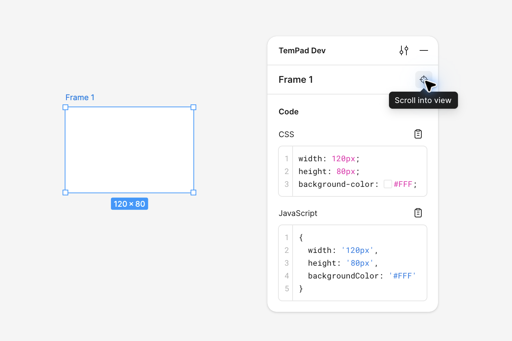
</picture>

当你在 TemPad Dev 的 Inspect 面板中将鼠标悬停在节点名称区域时，会出现一个按钮。点击后，当前选中的节点会被滚动到 Figma 视口的正中央。Figma 也提供了类似的 <kbd>⇧2</kbd> 快捷键，但该操作会放大并填满视口，往往不符合实际需求。Figma 的插件 API 实际上提供了在保持 100% 缩放的情况下移动视图的接口，因此我们也将这一能力作为补充提供了出来。

---

<a id="插件"></a>

## 输出插件

<picture>
  <source media="(prefers-color-scheme: dark)" srcset="packages/site/public/marketing/plugins-dark.png">
  <source media="(prefers-color-scheme: light)" srcset="packages/site/public/marketing/plugins-light.png">
  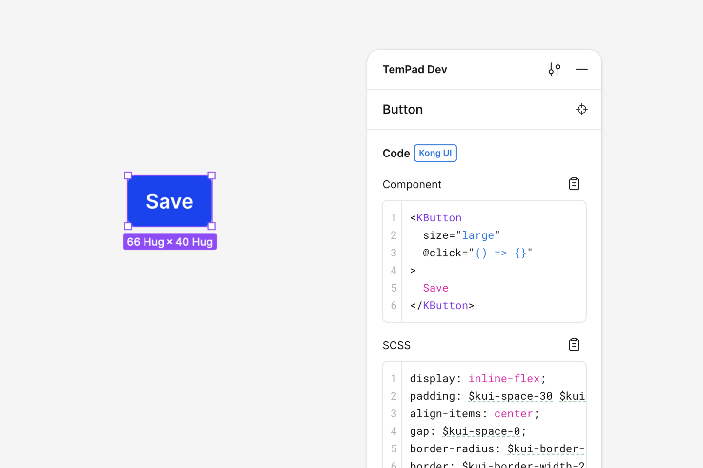
</picture>

插件可以用来自定义内置的代码输出，或添加自定义的代码块。

一个 TemPad Dev 插件本质上是一个简单的 JavaScript 文件，通过 `default` 导出或名为 `plugin` 的命名导出暴露插件对象。要安装插件，只需将插件文件的 URL 粘贴到 _Preferences > Plugins_ 中即可。一些内置插件也可以通过 `@{name}` 语法启用，例如 `@foo`，它对应的是我们 [插件注册表](https://github.com/ecomfe/tempad-dev/blob/main/packages/extension/plugins/available-plugins.json) 中的插件名称。

> [!NOTE]
> 插件代码存储在浏览器的本地存储中，不支持版本管理或自动更新，需要你在 UI 中手动更新。

### 创建插件

使用 `@tempad-dev/plugins` 包中提供的、带完整类型定义的 `definePlugin` 函数，可以简化插件的创建过程。

```sh
npm install -D @tempad-dev/plugins # 或 pnpm add -D @tempad-dev/plugins
```

下面是一个简单的示例插件，它会覆盖内置的 CSS 代码块，并隐藏 JavaScript 代码块：

```ts
import { definePlugin } from '@tempad-dev/plugins'

export default definePlugin({
  name: 'My Plugin',
  code: {
    css: {
      title: 'Stylus', // 自定义代码块标题
      lang: 'stylus', // 自定义语法高亮语言
      transform({ style }) {
        return Object.entries(style)
          .map(([key, value]) => `${key} ${value}`)
          .join('\n')
      }
    },
    js: false // 隐藏内置的 JavaScript 代码块
  }
})
```

更完整的示例可以参考 [Justineo/tempad-dev-plugin-kong](https://github.com/Justineo/tempad-dev-plugin-kong/)。

> [!NOTE]
> 插件文件必须是合法的 ES Module，并且需要通过 `default` 导出或 `plugin` 命名导出插件对象。

目前我们支持 4 种插件钩子：

- `transform`：将样式对象或代码转换为字符串形式，用于代码块输出。适合用于 Tailwind CSS、UnoCSS 等自定义结构。
- `transformVariable`：将 CSS 变量转换为其他格式，例如转换为 Sass 变量以用于设计令牌。
- `transformPx`：将像素值转换为其他单位或按比例缩放。
- `transformComponent`：将设计组件对象转换为开发侧的组件对象或字符串，用于生成设计系统的组件代码。

> [!TIP]
> 如果希望在生成的 CSS 中包含 JavaScript 变量，可以使用 `\0` 字符包裹变量名。这样会被转换为 JavaScript 的字符串插值。
> 例如返回 `\0foo\0`，则输入 `calc(var(--foo) + 10px)` 会被转换为 `` `calc(${foo} + 10px)` ``。

此外，你还可以为代码块指定自定义的 `title` 和 `lang`，或者将内置代码块设置为 `false` 以隐藏它。

完整的类型定义和辅助函数请参见 [`packages/plugins/src/index.ts`](./packages/plugins/src/index.ts)。

### 部署插件

请确保你的插件可以通过支持跨域请求的 URL 访问，例如托管在 GitHub 仓库或 Gist 中。比如可以使用 raw 地址：

```text
https://raw.githubusercontent.com/{username}/{repo}/refs/heads/{branch}/{filename}.js
```

> [!NOTE]
> 插件 URL 必须使用 HTTPS 并支持跨域请求；本地开发仍可使用 loopback HTTP URL。GitHub 或
> Gist 提供的 raw URL 通常可用。插件入口文件上限为 512 KiB，且必须是自包含 ES Module；
> 请在构建时打包依赖，不要在运行时加载。

在扩展能力边界上，插件代码按不可信代码处理。每次调用都会在 opaque-origin Chrome
sandboxed extension page 内启动一个全新的 Worker，并在完成或五秒超时后强制终止。
沙箱不暴露扩展 API 或 DOM，阻断存储与已测试的网络通道，并对结构化输入输出做有界校验。
插件仍会看到传给其 hook 的设计数据，也完全控制自己返回的代码；浏览器引擎漏洞、侧信道、
蓄意内存压力以及不安全的生成内容不属于该边界。仍建议审查插件来源。准确保证与非目标见
[威胁模型](./docs/security/local-mcp-threat-model.md)。

### 分享插件

你也可以将插件注册到我们的 [插件注册表文件](https://github.com/ecomfe/tempad-dev/blob/main/packages/extension/plugins/available-plugins.json) 中，这样就可以通过插件名直接安装。

**欢迎来 [添加你自己的精彩插件](https://github.com/ecomfe/tempad-dev/edit/main/packages/extension/plugins/available-plugins.json)！**

当前可用插件列表：

<!-- prettier-ignore-start -->
<!-- availablePlugins:start -->
| 插件名称 | 描述 | 作者 | 仓库 |
| -- | -- | -- | -- |
| `@kong` | Kong Design System | [@Justineo](https://github.com/@Justineo) |  [GitHub](https://github.com/Justineo/tempad-dev-plugin-kong) |
| `@kong/advanced` | Kong Design System（高级版） | [@Justineo](https://github.com/@Justineo) |  [GitHub](https://github.com/Justineo/tempad-dev-plugin-kong) |
| `@fubukicss/unocss` | FubukiCSS 的 UnoCSS | [@zouhangwithsweet](https://github.com/@zouhangwithsweet) |  [GitHub](https://github.com/zouhangwithsweet/fubukicss-tool) |
| `@nuxt` | Nuxt UI | [@Justineo](https://github.com/@Justineo) |  [GitHub](https://github.com/Justineo/tempad-dev-plugin-nuxt-ui) |
| `@nuxt/pro` | Nuxt UI Pro | [@Justineo](https://github.com/@Justineo) |  [GitHub](https://github.com/Justineo/tempad-dev-plugin-nuxt-ui) |
| `@baidu-health/wz-style` | 百度健康 wz-style 自定义样式 | [@KangXinzhi](https://github.com/@KangXinzhi) |  [GitHub](https://github.com/KangXinzhi/tempad-dev-plugin-wz-style) |
| `@baidu-health/med-style` | 百度健康 med-style 自定义样式 | [@KangXinzhi](https://github.com/@KangXinzhi) |  [GitHub](https://github.com/KangXinzhi/tempad-dev-plugin-med-style) |
| `@tailwind` | CSS 转 Tailwind CSS | [@haydenull](https://github.com/@haydenull) |  [GitHub](https://github.com/haydenull/tempad-dev-plugin-tailwind) |
| `@react-native` | CSS 转 React Native StyleSheet | [@CANntyield](https://github.com/@CANntyield) |  [GitHub](https://github.com/CANntyield/tempad-dev-plugin-react-native) |
<!-- availablePlugins:end -->
<!-- prettier-ignore-end -->

<details>
<summary><h3>查看 TemPad 组件代码</h3></summary>

> 该功能仅适用于由 TemPad Figma 插件生成的节点，而该插件目前仅在 _百度_ 内部可用。

目前此功能仅支持 Light Design 组件。

如果画布中存在由 TemPad Figma 插件生成的组件，TemPad Dev 可以在 Code 面板中直接输出该组件的调用代码。你也可以快速跳转到 TemPad Playground，对可运行的代码进行预览和调试。

</details>

<details>
<summary><h2><a id="quirks-mode"></a>Quirks 模式</h2></summary>

> [!CAUTION]
> 自 2025.04.01 起，Quirks 模式已不可用。Figma 移除了用于提取样式数据的 `window.DebuggingHelpers.logSelected` API。

> [!NOTE]
> TemPad Dev v0.1.0 新增

Quirks 模式是在 TemPad Dev v0.1.0 中引入的，当 `window.figma` 不可用时，你仍然可以使用该工具。该模式通过解析 Figma 的调试日志来提取样式数据，从而生成基础样式代码，但会存在一定限制。

当前已知无法生成或存在差异的功能包括：

- Effects 中添加的样式，对应的 CSS 属性如 `box-shadow`、`filter: blur()`、`backdrop-filter: blur()`。
- 渐变填充样式。TemPad Dev 只能检测到渐变的存在，并输出为 `linear-gradient(<color-stops>)`。
- 填充样式的混合模式，对应 CSS 的 `background-blend-mode`。
- 文本节点的 `font-family`，该值通过启发式方式获取，可能不准确。
- 除数字样式之外的高级 OpenType 配置，通常在实际中较少使用。
- [“将选中项滚动到视图中”](#scroll-selection-into-view) 功能在该模式下不可用。

除上述限制外，其余功能与标准模式基本一致。如果 Quirks 模式能够满足你的使用场景，就可以避免复制到草稿文件等繁琐操作，直接在只读视图中使用。但需要注意的是，该模式同样依赖于 Figma 全局暴露的调试接口，无法保证长期可用性。如果 Figma 再次移除相关接口，该模式也会随之失效。

<details>
<summary><h3>兼容性更新</h3></summary>

**2025.04.01**：Figma 移除了用于提取样式数据的 `window.DebuggingHelpers.logSelected` API，Quirks 模式因此不可用。

**2024.11.04**：TemPad Dev 成功在只读模式下重新获取了 `window.figma` API，但仍无法保证该能力的长期有效性。如果 Figma 再次移除相关接口，该模式也将不可用。

**2024.04.08**：TemPad Dev 通过当前尚未被封禁的调试接口，成功获取了大部分样式信息，并引入了新的 [Quirks 模式](#quirks-mode)。该模式不依赖 `window.figma`，而是通过解析调试日志生成样式代码，与标准模式存在少量差异。

**2024.03.20**：在我们向 Figma 社区论坛提交反馈后，Figma 团队表示将在未来几周内恢复只读模式下的 `window.figma` 接口。你可以在这个 [讨论帖](https://forum.figma.com/t/figma-removed-window-figma-on-view-only-pages-today/67292) 中跟踪该问题的进展。

</details>

</details>

## 致谢

使用 [WXT](https://wxt.dev/)、TypeScript 和 Vue 3 构建。

灵感来源于以下项目：

- <https://github.com/leadream/figma-viewer-chrome-plugin>
- <https://github.com/zouhangwithsweet/fubukicss-tool>
- <https://github.com/Inclushe/figma-ui3>
