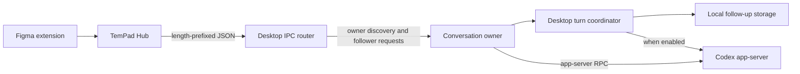

# Codex desktop IPC: protocol and integration research

Research date: **2026-09-15**. Inspected host: **Codex App 26.908.70816, build 9275,
macOS**. Native queue follow-ups: **2026-09-16 and 2026-09-17**. Bundled executable:
**codex-cli 0.154.0-alpha.6.2**.

Read this report when changing TemPad's Codex conversation routing, lifecycle,
comments, Queue, Steer, or Stop. It describes the installed desktop application's
private protocol, not a stable public API. The implementation and product rules
remain in [Design tasks, client integration, and feedback](../extension/mcp-design-tasks.md).

## Release-blocking installed-host findings

### 2026-09-20 implementation follow-up

Rechecked installed Codex App **26.915.31945, build 9922**, with bundled CLI
**0.155.0-alpha.9.2**. The current renderer still selects its server queue only when
enabled and the legacy queue is empty. Its `thread-follower-set-queued-follow-ups-state`
handler still calls the legacy replacement writer. A fresh targeted, read-only
`thread/queue/list` request found the conversation owner but returned `no-client-found`.
The input-box server requests use the internal renderer/app-server transport; the
native send-message tool exposes neither Queue mode nor targeted queue removal.

The live app-server also opens `CODEX_HOME/queue_1.sqlite`. Read-only SQLite access
can observe committed `queued_items` rows by `thread_id`, including WAL changes.
This corrects the earlier implication that the server queue cannot be read at all:
its persisted local state is accessible, although the existing follower IPC does
not expose it. Both stores were empty for the inspected task, so that probe alone
does not validate nonempty payload decoding or establish its feature-gate value.

The adapter now retains a populated legacy queue and uses native server admission
when a server database exists and the legacy queue is empty. It lazily discovers
the running desktop's unique bundled executable and manages a queue-only companion
process using the Hub's Codex home/configuration. Native list/add/delete operations
own all server writes; no queue items are copied between stores or written with SQL.
Unknown database/schema/read state fails with drafts retained. A missing database
retains the older-host path. The existing bounded Start fallback still checks both
stores before submitting. Stop follows each receipt's recorded backend, independently
of the current backend selection.

The source adapter has passed the isolated native-owner experiment described below,
including duplicate-delivery suppression, cancellation, ordering, and idle execution.
That experiment did not establish the renderer feature gate or desktop presentation;
the installed-host observations below provide separate evidence. Single-user legacy
read/merge/set has a residual race; atomicity alone is not a release gate.

The subsequent interactive check confirmed visible native A / Figma B / native C
coexistence, draft clearing, and execution in that order. Stop removed the Figma
submission and preserved the independent native submission, but did not interrupt
the running response. A broker regression reproduced cancellation snapshots being
sent before the explicit Stop action. The Hub consequently treats Stop as an
already-ended task and skips interruption. The broker now dispatches Stop before
publishing that snapshot, while retaining durable local cancellation. After the
extension refresh, Figma Stop interrupted the running Codex response, the user
confirmed the interruption, and the Hub logged `interrupted: true` for the exact
target turn at 2026-09-20 10:28:07 +08:00. The task remained cancelled on read-back.
A fresh task then delivered Figma Steer into the already-running response, which
acknowledged it without ending the turn first. Stopping that fresh task interrupted
the response again; after refreshing Figma, the user still saw cancellation and
native task read-back confirmed `status: cancelled`. This checks page-refresh
persistence, not every transport-failure or host-restart scenario.

Current archive evidence: `webview/assets/app-initial-a498f911edeb.js`, SHA-256
`34a75db63c7137eb4caecdba1f36d631c10c7912487e532fd5e9dafb175bb9be`;
`.vite/build/src-C3YaUE83.js`, SHA-256
`14c8c23e8b8dfa874d3fb5a50d54fb28eccf55fb83232c3ab29cb7c0ef0a0472`.

#### Read/append/set verification

A further 2026-09-20 check regenerated the complete app-server JSON Schema with
`generate-json-schema --experimental` from the installed executable. Its
`ClientRequest` union contains exactly six `thread/queue/*` methods: `add`, `list`,
`update`, `delete`, `reorder`, and `start`. There is no server-queue `set` or
whole-list replacement request. `update` accepts a single `queuedSubmissionId`
and `input`; `reorder` accepts only submission IDs, not new message content.
Scanning all 11,164 packed JavaScript files found the same six request names and
the `changed` notification, with no additional `thread/queue/*` operation.

The replacement call chain was traced again in the installed renderer and main
process: `thread-follower-set-queued-follow-ups-state` calls `acceptFromFollower`,
which applies a replacement through `storage.update`; `updateQueuedFollowUps`
commits `QUEUED_FOLLOW_UPS` through the global-state store. This path does not
forward a server-queue request. The complete follower handler registration also
contains no server-queue operation. A fresh connection discovered the current
conversation owner, but a targeted read-only `thread/queue/list` v0 request again
returned `no-client-found`.

For this installed build, reading the database, appending locally, and calling
the existing follower `set` therefore cannot implement a server-queue addition:
it writes a second list to the legacy store while leaving the server submissions
intact. This limitation is independent of concurrent user input or atomicity.
The verification did not submit, replace, or delete any live queue entries.

#### Queue-only companion process: verified feasibility

The absence of a direct owner RPC route does not prevent every native queue
integration. A subsequent experiment used two instances of the installed bundled
CLI, a shared temporary `CODEX_HOME`, and a local mock Responses server. No real
account, desktop task, or Figma document was changed. The original process created
and executed the fixture task. The companion process only initialized and called
queue APIs plus `thread/loaded/list`; it never resumed or executed that task.

Observed behavior in this build:

- The companion can call `thread/queue/add` for a persisted task owned by the
  original process. Its loaded-thread list remains empty.
- Both processes read the same native queue through `thread/queue/list`.
- Cross-process changes are not immediately pushed to the original process.
  Observed periodic notifications were approximately ten seconds apart. An
  eleven-second observation window caught both admission and deletion changes.
  The renderer's existing `thread/queue/changed` handler refetches its queue.
- After an active turn completes, the original process consumes the companion's
  queued message and emits the subsequent turn lifecycle. With the original
  task already idle, it also discovers and executes companion admissions without
  a new `thread/resume` or an externally requested `thread/queue/start`.
- A held-turn test enqueued native A, companion B, then native C. Deleting B by
  its returned submission ID preserved A and C. Releasing the held turn caused
  only the original process to execute A followed by C. The companion still had
  no loaded threads.
- `clientUserMessageId` is not an idempotency key: adding twice with the same
  value created two different submission IDs. Durable receipts and uncertain
  delivery reconciliation remain necessary.
- A newly created task without a persisted rollout could not be addressed from
  the companion. It became addressable after a fixture turn completed. This is
  a pre-admission error, not permission to resume the task in the companion.

This corrects the earlier blanket rejection of another app-server process.
A queue-only native writer is materially different from resuming or executing the
same task in a second process. The prototype establishes queue persistence,
cross-process observation, original-owner execution, and targeted cancellation.
It does not establish installed-desktop presentation or complete TemPad support.

The adapter discovers the unique running bundled executable, automatically manages
one companion connection, and restricts it to queue list/add/delete operations.
The companion inherits Codex home/configuration from the Hub. It must never
resume a task, start a turn, or execute a queued item in the companion. Keep native
owner IPC for lifecycle, direct idle submissions, Steer, and guarded interruption.
Do not copy messages between stores or issue direct SQL writes.

Receipts retain the stable TemPad feedback identity and an explicit backend
discriminator. Cancellation lists that backend, matches `clientUserMessageId`,
and deletes the matching native `queuedSubmission.id` values. Native IDs need not
be duplicated in the receipts, including when the admission response was lost.
Cancellation uses the admitting backend even after queue selection changes. Reserve before
dispatch and acknowledge native admission only after the RPC succeeds. On an
uncertain response, reconcile by client identity; absence alone does not prove
non-admission because the owner may already have consumed the item. Do not retry
an uncertain add automatically. Stop fences further admissions first, then deletes
only this task's admitted IDs and interrupts the captured owner turn independently.

The interactive checks above establish queue visibility/coexistence, ordered
execution, targeted removal, and interruption for the tested desktop configuration.
They do not expose the renderer gate value or measure a refresh-delay bound.
Restart and uncertain-response behavior also have deterministic regression coverage.
Figma shows native admission without waiting for the desktop's periodic refresh.

### Original installed-host findings

The 2026-09-17 installed-plugin acceptance exposed a queue-backend conflict. After
the user queued an independent message in Codex, admitting a Figma comment through
the legacy follower endpoint made that independent message disappear from the
displayed queue. The user reported that it did not reappear after Figma Stop.
Source inspection explains the queue selection: `R1t` selects the server queue only
when enabled **and** the legacy queue is empty, while `acceptFromFollower` always
writes legacy storage. This establishes a visibility/coexistence failure, not proof
that TemPad deleted the server-side submission. The adapter does not call
`thread/queue/delete`.

Basic Queue admission, consecutive submission, draft clearing, queued execution,
and Steer had passed immediately before this test. Those observations remain valid
for their exercised paths; they do not establish safe coexistence with independent
server-queue input. That finding blocked release until the later server-admission
implementation and interactive coexistence check described above.

Further inspection of the same installed build found these transport boundaries:

| Candidate access path                  | Evidence                                                                                                                         | Result                                                                                        |
| -------------------------------------- | -------------------------------------------------------------------------------------------------------------------------------- | --------------------------------------------------------------------------------------------- |
| Existing desktop IPC owner             | Complete follower handler registration in S1 `y9`; a targeted, read-only `thread/queue/list` v0 probe returned `no-client-found` | No server-queue route is exposed by the inspected follower registry.                          |
| Desktop's generic `mcp-request` bridge | S2 dispatches it through `handleClientRequest` from a registered Electron view; the outer IPC handler checks the trusted sender  | This is an internal renderer bridge, not a generic method on the desktop coordination socket. |
| App tools native pipe                  | S2 `wse`, `Tse`, and `Dse` accept `tools/list`, `tools/call`, and `tools/cancel`; calls dispatch catalogued app tools            | No generic app-server forwarding operation or queue tool was found.                           |
| Existing local app-server transport    | The running bundled process uses stdio; inspection found no named Unix or TCP listener for that process                          | There is no discovered local endpoint for a second plugin client.                             |
| SSH app-server control transport       | S2 `Tk` selects it only for SSH hosts; `Ck` owns the remote connection                                                           | It does not provide access to this existing local conversation.                               |

No server-queue mutation was used for that investigation. These results apply to
the inspected build and running host; they do not prove that every future host will
lack an endpoint. A direct owner route would provide immediate native queue
notifications. The later isolated companion-process experiment above establishes
another route with periodic observation, without taking ownership of the task.
That process must be managed automatically by the plugin/runtime; a manually
launched helper or a changed host configuration is not the normal installation path.

Figma Stop also failed to interrupt the active Codex response in this test, although
the design task became permanently cancelled. A deterministic regression showed
that conversation-only MCP metadata could overwrite a binding's lifecycle-derived
turn ID, leaving Stop without its interruption target. The working-tree fix retains
that identity and uses a single known active native turn when reconnecting without
turn metadata; absent or ambiguous state is not guessed. A refreshed-runtime test
still cancelled the design task without interrupting the host response. A further
deterministic gap was found: after MCP disconnection, the fallback binding retained
only the conversation, and Stop skipped IPC even when native state identified one
active turn. Capability reporting and Stop now share target resolution, capture the
target before cancellation callbacks, and record skipped, dispatched, acknowledged,
and failed interruptions. These are reproduced failure paths; the live request
metadata and interruption result were not retained, so neither is conclusive
attribution of the observed interruption failure. The subsequent broker-ordering
regression and successful refreshed-host acceptance are recorded above.

## Findings

1. **Desktop IPC has a native queue interface.**
   `thread-follower-set-queued-follow-ups-state` persists a conversation's local
   follow-up queue and acknowledges the write without waiting for execution.
   TemPad now reads the committed local queue and submits a merged list through
   this interface. An unavailable local store retains the bounded Hub waiting path.
2. **The native queue interface replaces a whole conversation queue.** It is not
   an atomic append operation. Its request has no expected revision, and its
   acknowledgement has no message ID or queue revision. Finding this method does
   not establish that an independent producer can safely append alongside the
   Codex composer.
3. **The host has two queue implementations.** The desktop coordinator maintains
   a legacy local queue; a feature-gated app-server queue exposes separate
   `thread/queue/*` operations. These are different protocols and stores. The
   desktop socket does not expose arbitrary app-server methods.
4. **Native Steer is already integrated.** The owner resolves the active turn and
   forwards user input through `turn/steer`. Native Queue admission, execution,
   Steer acceptance, and task completion are distinct events.
5. **Targeted interruption is narrower than the complete Stop button behavior.**
   `expectedTurnId` prevents interruption of a later turn. That guarded path does
   not run every unguarded Stop side effect, including the goal-pause branch.
   TemPad's permanent Figma write fence must remain independent.
6. **Response annotations are message context, not a general element-anchor API.**
   The host serializes selected response text and comments into a user prompt.
   The optional source is a message ID and text range; there is no Figma node
   source in that contract.

The working-tree integration uses best-effort read/merge/set, with conversation-level
serialization, stable message IDs, durable receipts, and targeted cancellation.
The endpoint still has no compare-and-swap protection against simultaneous composer edits.

## Contents

- [Evidence and limits](#evidence-and-limits)
- [Protocol boundaries](#protocol-boundaries)
- [Connection and wire protocol](#connection-and-wire-protocol)
- [Routing and versioning](#routing-and-versioning)
- [Desktop method inventory](#desktop-method-inventory)
- [Starting and steering turns](#starting-and-steering-turns)
- [Native queues](#native-queues)
- [Lifecycle subscriptions and interruption](#lifecycle-subscriptions-and-interruption)
- [Input context and annotations](#input-context-and-annotations)
- [TemPad integration assessment](#tempad-integration-assessment)
- [Reproducing and extending the research](#reproducing-and-extending-the-research)

## Evidence and limits

This report distinguishes four kinds of evidence:

| Evidence                        | What it establishes                                                                   | What it does not establish                                                      |
| ------------------------------- | ------------------------------------------------------------------------------------- | ------------------------------------------------------------------------------- |
| Installed client code           | Routes, payload consumers, storage operations, guards, and control flow in this build | Success against every owner, feature assignment, or operating system            |
| Bundled executable schema       | App-server request and response shapes generated by this binary                       | Exposure over the desktop IPC socket or current feature enablement              |
| Live observation                | Behavior exercised against the running macOS host                                     | Unexercised mutations, Windows behavior, or a complete installed Figma workflow |
| TemPad implementation and tests | Current adapter behavior and deterministic regression coverage                        | Independent confirmation of private host behavior                               |

The JavaScript below was read from `Contents/Resources/app.asar`. Previously
extracted files were compared byte-for-byte with the installed archive before use.
Minified function names are search aids for this build only.

| Key | Archive entry or source                                                                                  | Relevant search anchors                                                                            |
| --- | -------------------------------------------------------------------------------------------------------- | -------------------------------------------------------------------------------------------------- |
| S1  | `.vite/build/src-CCXHtyvY.js`                                                                            | `IpcRouter`, `IpcClient`, `s9`, `thread-owner-discovery`, `request-version-mismatch`, `nv`         |
| S2  | `.vite/build/main-DaMR-wdT.js`                                                                           | `Host manager coordination`, `thread-follower-set-queued-follow-ups-state`, `acceptFromFollower`   |
| S3  | `webview/assets/app-initial-4d7ea7f81c2d.js`                                                             | `wGt`, `R1t`, `F1t`, `H1t`, `Tvn`, `l4t`, `N$t`, `cKt`, `Kan`, `responseTextAnnotations`           |
| S4  | `webview/assets/src-996ff3571e1f.js`                                                                     | `lv`, `App input requires confirmation before legacy delivery`, `threadQueue`, `QUEUED_FOLLOW_UPS` |
| S5  | `codex_app_server_protocol.v2.schemas.json`, generated with `--experimental` from the bundled executable | `ThreadQueueAddParams`, `QueuedSubmission`, `TurnSteerParams`, `AdditionalContextKind`             |

Additional source S6: `.vite/build/window-all-closed-BxbCP6YG.js`, specifically
`JT.updateAndPersist`, `iE`, and `.codex-global-state.json`, establishes the local
commit-before-acknowledgement behavior used by the queue integration.

SHA-256 fingerprints:

```text
S1 a42da38cbb14b28399f1d54fcf453bffc5e9802663e7e098f187c8378f4c7a40
S2 0765260be74e8843630d5a92e30bca574783892688e67180c119a5c58679bb61
S3 5dcf4a29db25b086f9bd11d053eec60cf0c50bfd988494969cec452e03f19245
S4 d85e9d112eebcc71ae35bc012bca39313111c438f360092b5375165239bbd02c
S5 7b9e7d385fffef8d428cc5490b56ce9c393bd3ed7bc7ccd730956387e723ec05
S6 8939f42fd89899a649b8062699b386e9ff933c241155b611c3b5ec7a738673ed
```

### Live evidence

A read-only probe on 2026-09-15 at 23:14 +08:00 connected to the existing Codex-home
socket using `clientType: "tempad-dev"`. It used this research conversation's
runtime thread identity, without creating a conversation or changing its queue.

| Probe                                            | Observed result                                                   |
| ------------------------------------------------ | ----------------------------------------------------------------- |
| `initialize`, version 0                          | Success; host assigned a client ID                                |
| Exact `thread-owner-discovery`, version 1        | Success; returned an owner and `supportsUntrustedAppInput: true`  |
| Targeted discovery with incompatible version 999 | `no-client-found`; discovery rejected the version before dispatch |

A controlled macOS Steer probe on 2026-09-15 used TemPad's adapter:
the busy `start-turn` rejection was followed by `steer-turn`, the diagnostic user
message arrived, and the durable receipt recorded `delivered` with a turn ID.
That establishes direct macOS IPC delivery, not a new end-to-end Figma UI test.

On 2026-09-16, the working-tree native queue adapter admitted a deliberately paused
diagnostic into this conversation, verified its committed composer context, and removed
only that message through IPC. The queue was empty before and after the probe. Admission,
including the original-conversation snapshot, took 782.96 ms in this single observation.
The probe did not execute the diagnostic or measure the read-to-write conflict window.
Unit tests cover preservation of existing messages, multiple batches, uncertain admission,
restart recovery, and targeted removal. Automatic queued execution, simultaneous native
composer edits, and the full installed-plugin/Figma UI flow still need live verification.
Windows and Linux observations remain limited to source and deterministic tests.

## Protocol boundaries



Three surfaces must not be conflated:

| Surface                     | Wire/API shape                                                                            | Role                                                    |
| --------------------------- | ----------------------------------------------------------------------------------------- | ------------------------------------------------------- |
| Desktop coordination socket | Four-byte length prefix and JSON envelopes with `type`, `requestId`, `version`            | Routes existing desktop clients and conversation owners |
| Codex app-server            | JSON-RPC-shaped requests using `id`, `method`, and `params`; methods such as `turn/start` | Executes and stores Codex threads and turns             |
| Desktop view/service bridge | Internal renderer service calls, including global-state and queue-send locks              | Coordinates the app's own UI and native services        |

Official [Codex App Server documentation](https://learn.chatgpt.com/docs/app-server#protocol)
describes the second surface: bidirectional JSON-RPC without the `jsonrpc` field,
using JSONL over stdio or WebSocket transports. That documentation does
not define the desktop follower methods. Even an app-server Unix control socket
uses a different handshake from the desktop coordination socket.

Names such as `get-global-state`, `queued-follow-up-send-lock-acquire`, and
`thread/queue/add` appearing in the desktop bundle do not make them callable as
desktop socket methods. Trace each call to its transport and registered handler.
An app tools pipe advertised by `CODEX_APP_TOOLS_PIPE_PATH` is also not the socket
described here.

## Connection and wire protocol

Evidence: S1; TemPad's [codex-ipc.ts](../../packages/mcp-server/src/agent-clients/codex-ipc.ts).

### Endpoints and ownership

| Platform             | Host endpoint                                                   | Observed handling                                                                                                    |
| -------------------- | --------------------------------------------------------------- | -------------------------------------------------------------------------------------------------------------------- |
| macOS / Unix         | `$CODEX_HOME/ipc/ipc.sock`, normally `~/.codex/ipc/ipc.sock`    | Host creates/validates a current-user directory, sets directory mode `0700`, and secures its socket with mode `0600` |
| Legacy Unix fallback | `<os.tmpdir()>/codex-ipc/ipc-<uid>.sock`; UID 0 uses `ipc.sock` | Host considers an existing socket with matching UID and a suitably protected parent                                  |
| Windows              | `\\.\pipe\codex-ipc`                                            | Fixed local named pipe; Unix inode/UID checks do not apply                                                           |

The host can create the router when necessary. TemPad deliberately connects only
to an existing endpoint: starting a replacement router does not create a valid
conversation owner and would obscure a missing host.

TemPad validates Unix socket and parent ownership and rejects a group/world-writable
parent. On Windows it accepts only the fixed local pipe, leaving connection access
to the OS. These controls establish the local OS-user boundary. `clientType` is a
registration label, not an authentication token or a grant of product-level authority.

### Framing

Each frame is:

```text
uint32 little-endian UTF-8 byte length
JSON payload of exactly that byte length
```

The host rejects zero-length frames and payloads above **268,435,456 bytes
(256 MiB)**. Reads may split either header or payload; one socket read may contain
multiple frames. The bound is a transport maximum, not an appropriate comment-size
limit. TemPad applies much smaller feedback limits before encoding.

### Envelopes

The following illustrates the desktop wire format. IDs are examples, not reusable
identities:

```json
{
  "type": "request",
  "requestId": "request-uuid",
  "sourceClientId": "initializing-client",
  "version": 0,
  "method": "initialize",
  "params": { "clientType": "tempad-dev" },
  "timeoutMs": 2000
}
```

A successful initialization returns `type: "response"`, the same `requestId`,
`resultType: "success"`, `method: "initialize"`, `handledByClientId`, and
`result: { clientId }`. Use the assigned ID on subsequent requests. Reconnection
creates a new client identity; an old owner ID is not a durable address.

| Envelope                    | Important fields and behavior                                                                                                         |
| --------------------------- | ------------------------------------------------------------------------------------------------------------------------------------- |
| `request`                   | `requestId`, `sourceClientId`, `method`, `version`, `params`; optional `targetClientId`, top-level `hostId`, `timeoutMs`              |
| `response`                  | Correlates by `requestId`; success carries `method`, `handledByClientId`, `result`; failure carries `resultType: "error"` and `error` |
| `broadcast`                 | `sourceClientId`, `method`, `version`, `params`; optional `targetClientIds`; no acknowledgement                                       |
| `client-discovery-request`  | A separate `requestId` and the original `request`; asks a client whether it can handle that request                                   |
| `client-discovery-response` | Discovery `requestId` and `response: { canHandle: boolean }`                                                                          |

TemPad answers discovery requests with `canHandle: false`: it is a consumer, not
a desktop conversation owner. Leaving these messages unanswered can delay other
clients' discovery.

Broadcasts go to other connected clients, optionally restricted by recipient IDs.
The router sets their source to the registered sender. They are not replayable
event logs; a newly connected consumer cannot infer current state from silence.

## Routing and versioning

Evidence: S1's `findClientForRequest`, `handleClientDiscoveryRequest`, `nv`, `iv`,
and `av`; S2/S3's owner assertions and follower dispatcher.

1. Register with `initialize`.
2. Discover the exact owner using `thread-owner-discovery` v1 and
   `{ hostId: "local", conversationId }`.
3. Retain `handledByClientId`, and verify the capabilities required by the intended
   operation. TemPad currently requires `supportsUntrustedAppInput: true`.
4. Target subsequent follower requests at that owner. The router still asks the
   selected client whether it can handle each targeted request.
5. Validate the response method, owner, and operation-specific acknowledgement.
   Rediscover after owner loss rather than selecting a focused or similarly named task.

Without a target, the router asks other clients and selects a successful handler.
Its discovery timeout is **10 seconds**. Forwarded requests have a separate timeout,
using the supplied `timeoutMs` or the router's default. A caller's shorter timer
can expire while host discovery is still running.

The version registry is per method, not a single negotiated protocol version.
Unlisted methods default to version 0; this does not mean they have a handler.
For `thread-follower-*` requests, a non-null **top-level** `hostId` adds one to the
base version. `params.hostId` used by discovery and broadcasts is a different field.
TemPad's local follower calls omit the top-level host ID and use base versions.

The interrupt method also accepts a legacy local v3 path. The native client's
version selector uses v3 when `expectedTurnId` is absent and v4 for the guarded
shape. Do not infer that a lower version preserves the newer interruption guarantee.

### Failure meanings

| Failure                                                 | Interpretation                                                                                                 |
| ------------------------------------------------------- | -------------------------------------------------------------------------------------------------------------- |
| `no-client-found`                                       | No client accepted discovery; can mean missing owner, wrong host, incompatible version, or unavailable handler |
| `request-version-mismatch`                              | A dispatched request failed the receiving client's version check                                               |
| `no-handler-for-request`                                | The receiving client has no handler for the dispatched method                                                  |
| `request-timeout`, disconnect, or caller timeout        | A mutating request may already have run; absence of acknowledgement is not rollback                            |
| Wrong response method, wrong owner, or malformed result | Delivery is not confirmed; do not treat socket success as operation success                                    |

The read-only probe's deliberately wrong discovery version returned
`no-client-found`, not `request-version-mismatch`, because rejection happened
during discovery. TemPad's error handling and capability reporting should retain
that ambiguity rather than always presenting it as an unloaded conversation.

## Desktop method inventory

This is the complete **thread-follower handler set** registered in S1 and consumed
by S2/S3 for this build. Versions below are the base/local versions. Results are
the contents of the outer IPC response's `result`, after the service bridge has
removed its internal method wrapper.

### Requests

| Method                                                   | Version | Parameters / result                                                                                                                      | Meaning                                                                          |
| -------------------------------------------------------- | ------- | ---------------------------------------------------------------------------------------------------------------------------------------- | -------------------------------------------------------------------------------- |
| `initialize`                                             | 0       | `{ clientType }` → `{ clientId }`                                                                                                        | Router registration, handled separately from thread requests                     |
| `thread-owner-discovery`                                 | 1       | `{ hostId, conversationId }` → `{ supportsUntrustedAppInput: true }`; owner in envelope                                                  | Discover an existing owner                                                       |
| `thread-follower-start-turn`                             | 2       | `{ conversationId, turnStart: { request, context? } }` → `{ result: { turn } }`                                                          | Submit a turn through its owner                                                  |
| `thread-follower-steer-turn`                             | 1       | Conversation, `input`, `restoreMessage`, optional message ID, context, attachments, service tier, tool output → `{ result: { turnId } }` | Steer the active turn; tool-output behavior differs                              |
| `thread-follower-interrupt-turn`                         | 4       | Conversation, `mode`, `expectedTurnId` → `{ ok, interruptedTurnId, goalPauseError? }`                                                    | Targeted interruption                                                            |
| `thread-follower-set-queued-follow-ups-state`            | 1       | `{ conversationId, state: { [conversationId]: messages } }` → `{ ok: true }`                                                             | Replace the local follow-up queue                                                |
| `thread-follower-load-complete-history`                  | 1       | `{ conversationId }` → `{ revision }`                                                                                                    | Hydrate history and establish a stream revision; bridge permits a longer timeout |
| `thread-follower-compact-thread`                         | 1       | `{ conversationId }` → `{ ok: true }`                                                                                                    | Initiate owner-side compaction                                                   |
| `thread-follower-edit-last-user-turn`                    | 2       | Conversation plus edit parameters → `{ ok: true }`                                                                                       | Edit/revert through the owner; not ordinary feedback                             |
| `thread-follower-update-thread-settings`                 | 2       | Conversation, `threadSettings`, optional `activeTurnId`, `condition` → `{ applied }`                                                     | Update next-turn settings or active-turn permissions                             |
| `thread-follower-command-approval-decision`              | 1       | Conversation, `requestId`, `decision` → `{ ok: true }`                                                                                   | Answer an existing command approval                                              |
| `thread-follower-file-approval-decision`                 | 1       | Conversation, `requestId`, `decision` → `{ ok: true }`                                                                                   | Answer an existing file-change approval                                          |
| `thread-follower-permissions-request-approval-response`  | 1       | Conversation, `requestId`, `response` → `{ ok: true }`                                                                                   | Answer an existing permissions request                                           |
| `thread-follower-submit-user-input`                      | 1       | Conversation, `requestId`, `response` → `{ ok: true }`                                                                                   | Answer an existing user-input request                                            |
| `thread-follower-submit-mcp-server-elicitation-response` | 1       | Conversation, `requestId`, `response` → `{ ok: true }`                                                                                   | Answer an existing MCP elicitation                                               |

An `{ ok: true }` here has method-specific meaning. For example, accepting an
approval response or initiating compaction does not establish completion of the
underlying work. This inventory is not authorization for TemPad to answer host
approvals or change model, permission, or task settings.

### Broadcasts

| Method                                     | Version | Meaning / payload highlights                                                        |
| ------------------------------------------ | ------- | ----------------------------------------------------------------------------------- |
| `thread-stream-following-changed`          | 1       | `{ hostId, conversationId, following }`; subscribe/unsubscribe to an owner's stream |
| `thread-stream-following-status-requested` | 1       | Owner asks followers to announce whether they still follow                          |
| `thread-stream-state-changed`              | 11      | `{ hostId, conversationId, change }`; full snapshot or revisioned patches           |
| `thread-queued-followups-changed`          | 2       | `{ hostId, conversationId, messages }`; local queue state changed                   |
| `thread-read-state-changed`                | 3       | Synchronizes read state, with host context                                          |
| `thread-archived`                          | 2       | Archive coordination                                                                |
| `thread-unarchived`                        | 1       | Unarchive coordination                                                              |
| `client-status-changed`                    | 0       | Client ID, client type, and connected/disconnected state                            |
| `ipc-connection-reset`                     | 1       | Invalidate connection-dependent state and re-establish coordination                 |

S1 also exposes an `ide-context` request helper (v0, `{ workspaceRoot }` →
`{ ideContext }`) and forwarding for `query-cache-invalidate`,
`automation-capability-event`, `automation-run-triggered-event`, and
`app-connect-oauth-callback-received` broadcasts (v0). These are peripheral to
TemPad's design-task path; their full producer payloads and availability were not
validated. They are not a generic app command-execution interface.

## Starting and steering turns

Evidence: S3's start-turn handler, busy guard, `N$t`, `L$t`, and `I$t`;
[codex-feedback.ts](../../packages/mcp-server/src/agent-clients/codex-feedback.ts).

### Start

The desktop request wraps the app-server request in `turnStart`:

```ts
{
  conversationId,
  turnStart: {
    request: {
      threadId: conversationId,
      clientUserMessageId,
      input: [{ type: 'text', text, text_elements: [] }]
    },
    context: { responseItems }
  }
}
```

The owner prepares settings and context, requires an existing streaming
conversation, injects any response items, and submits the turn. If nonempty
`context.responseItems` are present while the conversation is active, it rejects
before creating the turn with:

```text
App context must wait until the current turn finishes
```

This guard lets TemPad's Hub waiting fallback retry a known busy rejection. It is
not a native queue acknowledgement. Removing `responseItems` just to avoid the
guard does not establish Queue semantics.

TemPad's body is user input. A separate paired `untrusted_input` call/output carries
the design task ID, so a conversation that has owned several Figma tasks can
identify the right one. Model, approval, and sandbox overrides are not supplied.
Successful delivery requires `response.result.result.turn.id` and the expected owner.

### Steer

The plain-user-input shape is:

```ts
{
  conversationId,
  clientUserMessageId,
  input: [{ type: 'text', text, text_elements: [] }],
  restoreMessage: { text, context: {} },
  additionalContext: {
    'tempad-design-task': { kind: 'untrusted', value: taskContext }
  }
}
```

The owner checks for an active turn, adds a pending steering message to its view,
waits for an actual turn ID if necessary, and submits `turn/steer` with
`expectedTurnId`. Its implementation can reconcile a backend-reported active-turn
ID mismatch and retry against that ID. Therefore this follower method means
“steer the owner's active turn”; it does not expose TemPad's own expected-turn
precondition in its request shape.

Successful desktop acknowledgement contains `response.result.result.turnId`.
The host distinguishes outcome-unknown errors from known rejection and tracks
unconfirmed submissions. TemPad retains its own receipt as well and does not
replay uncertain delivery automatically.

Supplying `toolOutput` changes the owner helper's backend path to `turn/start`
with empty user input and standalone tool output. It is not interchangeable with
user-authored comments. `restoreMessage` is restoration/display context, not a
substitute for `input`.

The official [Steer contract](https://learn.chatgpt.com/docs/app-server#steer-an-active-turn)
requires an active turn and its expected ID. The desktop owner performs that
translation; TemPad should not bypass it by opening a second app-server process.

## Native queues

### Local desktop queue admission

Evidence: S1 registration; S2/S3 follower dispatcher; S3 `R1t.acceptFromFollower`,
its private storage writer, and `F1t`; S4 `lv`.

The request is a state update, not a message append:

```ts
{
  conversationId,
  state: {
    [conversationId]: completeReplacementMessageList
  }
}
```

The dispatcher passes only `state[conversationId]`, defaulting a missing entry to
`[]`. **Omitting that entry requests an empty queue.** Other conversation keys in
the submitted object are not a multi-conversation update through this handler.

The coordinator:

1. Validates the proposed message list and updates its pending in-memory state.
2. Serializes storage writes and checks that it is still the conversation owner.
3. Replaces that conversation's entry in local follow-up storage; an empty list
   removes the entry.
4. Initiates a queue-state broadcast and wakes the execution coordinator.
5. Resolves the request with `{ ok: true }` after the storage operation settles.

It does not await message execution or acknowledgement by every broadcast
recipient. Broadcast failure is logged separately. There is no queue revision,
compare-and-swap token, or per-message admission result in this request/response.

### Message representation and provenance

The legacy queue stores composer-shaped objects. These are distinct from the
`UserInput[]` passed directly to `start-turn` and `steer-turn`. The following is
a structural example from native producers and consumers. The adapter's variant
omits `workspaceRoots` so the owner derives its existing roots and permissions,
and carries the task ID as untrusted `writingBlockAdditionalContext`:

```ts
{
  id: messageId,
  text: displayText,
  context: {
    prompt: userPrompt,
    addedFiles: [],
    fileAttachments: [],
    imageAttachments: [],
    commentAttachments: [],
    ideContext: null,
    workspaceRoots: [cwd]
  },
  cwd,
  createdAt,
  // Optional native state includes submissionOptions, pausedReason,
  // response annotations inside context, and writingBlockAdditionalContext.
}
```

The preparation code renders `context.prompt` and context attachments into model
input. Top-level `text` alone is insufficient. Several attachment collections are
read as arrays without defaults; `{ text, context: {} }`, used by the verified
Steer path, is not a complete legacy queued message.

The legacy writer rejects a batch if any message has either:

- `context.untrustedAppMessage != null`; or
- a `context.mcpAppModelContextAttachments` entry with `untrusted: true`.

The error is `App input requires confirmation before legacy delivery`. Automatic
execution also checks this condition. Do not remove provenance flags simply to
make the old queue accept an App payload. User-authored design instructions and
captured Figma metadata have different roles; a native queue integration must
preserve that distinction through the host's supported preparation path.

### Concurrent writes and recovery

Owner-side serialization and the app's `codex-queued-follow-up-state` storage lock
do not turn an external replacement list into an atomic append. A stale list can
overwrite a composer edit even when both writes individually succeed.

The registered follower API has no corresponding queue-list request or
revision-checked append request. `thread-queued-followups-changed` carries a list,
but no queue revision or initial-snapshot handshake. A conversation stream
snapshot should not be assumed to provide the coordinator's separate queue store.
Internal `readState` and global-state services exist, but are not thereby exposed
on this socket.

TemPad reads `queued-follow-ups` from the host's `.codex-global-state.json` without
modifying that file. S2 uses `updateAndPersist`; S6 writes and commits the complete
file before updating the in-memory store and resolving the native write. Each
admission reads again after durable receipt preparation, immediately before dispatch.
A missing or unreadable store uses the existing Hub waiting path; incompatible queue
contents fail without replacement. This is a best-effort integration, not atomic append.
Even obtaining an initial list is insufficient to exclude intervening composer edits. Never submit only TemPad's new
batch as the replacement list when other queued messages may exist. Likewise,
retrying an acknowledged or uncertain replacement can restore messages that the
host has already consumed or that the user has removed.

### Execution and interruption

The local coordinator automatically processes the queue when client readiness,
ownership, resume state, and turn state allow it. Pending writes, local deferrals,
paused messages, and an active turn can delay execution. It acquires a native
per-message send lock, prepares the message, and removes it after a successful
send. A failure can retain the message with a `pausedReason`.

An interrupted turn marks legacy queued messages as paused; the coordinator has
separate methods for resuming interrupted messages, removing, editing, reordering,
and sending a queued message immediately. Those internal methods do not each have
a dedicated follower IPC route in the inspected registry. Native composer UI
capability is therefore broader than the exposed socket method inventory.

Keep these events separate:

| Event                              | Meaning                                                                                          |
| ---------------------------------- | ------------------------------------------------------------------------------------------------ |
| TemPad accepts a batch             | TemPad owns a pending delivery attempt                                                           |
| Native queue storage acknowledges  | Host owns the stored queue state                                                                 |
| Queue item disappears              | Could have been sent, edited, deleted, or cleared; disappearance alone is not proof of execution |
| Start/Steer acknowledges a turn ID | Host accepted input into a turn                                                                  |
| Turn completes                     | That turn ended; the design task or review may remain open                                       |

### App-server queue

Evidence: S3 `Tvn` and the coordinator's server-queue selection; S4's `threadQueue`
compatibility entry; S5's generated schema.

The desktop can use app-server queue storage for non-ephemeral conversations when
the `2120612410` feature gate and `threadQueue` version capability are satisfied.
The compatibility table starts that capability at `0.148.0-alpha.14`. A capable
binary version alone does not establish the feature gate's value.

| App-server method      | Required parameters                        | Response                |
| ---------------------- | ------------------------------------------ | ----------------------- |
| `thread/queue/add`     | `threadId`, `clientUserMessageId`, `input` | `{ queuedSubmission }`  |
| `thread/queue/list`    | `threadId`; optional `cursor`, `limit`     | `{ data, nextCursor? }` |
| `thread/queue/update`  | `threadId`, `queuedSubmissionId`, `input`  | `{ queuedSubmission }`  |
| `thread/queue/delete`  | `threadId`, `queuedSubmissionId`           | `{ deleted }`           |
| `thread/queue/reorder` | `threadId`, `queuedSubmissionIds`          | Empty result object     |
| `thread/queue/start`   | `threadId`; optional `queuedSubmissionId`  | `{ turn }`              |

`QueuedSubmission` contains `id`, `clientUserMessageId`, and `input`. The
`thread/queue/changed` notification contains `threadId`; the desktop refetches
the list. These schemas were generated from the installed binary with experimental
fields enabled; no app-server queue mutations were performed.

The local coordinator selects the server queue only when it is enabled **and the
legacy queue is empty**. Adding a legacy entry can change which queue is selected.
The follower state-replacement handler still writes the legacy store; it is not
a wrapper around `thread/queue/add`. Coexistence and ordering across the two
stores require explicit verification.

The app-server API's atomic add and targeted delete are a better semantic fit for
multiple producers, but no generic app-server forwarding method was found in the
desktop follower registry. Whether TemPad can reach these operations through an
existing, supported owner connection remains unresolved. Starting another server
or editing Codex's global-state file would not satisfy the normal installation path.

## Lifecycle subscriptions and interruption

Evidence: S3 `Kan`, the stream coordinator, `interruptConversationSelf`, and
`cKt`; [codex-lifecycle.ts](../../packages/mcp-server/src/agent-clients/codex-lifecycle.ts)
and [codex-turn-state.ts](../../packages/mcp-server/src/agent-clients/codex-turn-state.ts).

### Stream state

Subscribe by broadcasting `thread-stream-following-changed` v1 to the exact owner
with `{ hostId: "local", conversationId, following: true }`. Install the receive
handler first. The owner responds with `thread-stream-state-changed` v11:

```ts
// params.change
{ type: 'snapshot', revision, conversationState }
{ type: 'patches', baseRevision, revision, patches, acceptedTextChanges? }
```

The initial snapshot contains conversation state, potentially including transcript
content. Subsequent patches use native paths and values. TemPad projects only turn
IDs and statuses from legacy or canonical turn history; it does not persist the
transcript. Apply a patch batch atomically. A revision gap, unsupported lifecycle
path, changed owner, or reconnect requires a new snapshot before trusting controls.

Respond to `thread-stream-following-status-requested` by re-announcing the
subscription. Unsubscribe on teardown. Queue broadcasts and stream revisions are
separate mechanisms; a valid turn-state revision does not validate a queue list.

### Targeted Stop

TemPad sends:

```ts
{
  conversationId,
  mode: 'user-stop',
  expectedTurnId
}
```

The owner returns a successful no-op with `interruptedTurnId: null` when the
expected turn is no longer the active in-progress turn. It does not chase a new
turn. A matching interruption returns the interrupted ID. Validate the owner,
`ok`, and ID independently of the outer transport response.

The native unguarded Stop path can pause a goal, update other state, clean up
background work, and interrupt descendants. With `expectedTurnId`, the owner
returns through its guarded interrupt helper before the goal-pause branch.
Matching targeted interruption can still trigger descendant cleanup. Do not
equate an IPC interrupt acknowledgement with stopping every future source of
work or clearing a native queue.

TemPad cancels the design task and fences Figma writes before requesting host
interruption. An IPC failure cannot remove that fence. Cancelling a Hub promise
does not remove messages already owned by Codex. TemPad therefore removes this task's
native queue IDs and reconciles failed or late removals while preserving unrelated
user messages. The task fence remains necessary even if cancellation
races with execution.

## Input context and annotations

Evidence: S3 `g2t`, `Sv`, `i4t`, `l4t`, `responseTextAnnotations`, and the annotation
schema; S4's untrusted-input predicate; S5's context-kind enum.

| Data                         | Current role                                                                         | Integration consequence                                     |
| ---------------------------- | ------------------------------------------------------------------------------------ | ----------------------------------------------------------- |
| User feedback text           | `input` for direct Start/Steer; `context.prompt` for legacy queued messages          | Preserve the user's wording and instruction role            |
| Captured Figma names and IDs | Target context                                                                       | Keep them distinguishable from user instructions            |
| Design task ID               | Separate untrusted context in TemPad's Start/Steer adapters                          | Native queue preparation must retain exact task binding too |
| `responseItems`              | Raw paired model-context items on Start                                              | Nonempty items trigger the busy-turn guard                  |
| `additionalContext`          | Named values with a context kind; binary enum includes `untrusted` and `application` | Do not promote external context to application authority    |
| `responseTextAnnotations`    | Native response-selection context serialized into the prompt                         | Not an IPC method or Figma node attachment                  |

Native annotation serialization has this shape:

```text
# Response annotations:
<instructions for handling the annotations and reply directives>
<response-annotations>
[{"text":"Selected response text","annotation":"User comment","source":{"messageId":"message-id","startOffset":0,"endOffset":22}}]
</response-annotations>
```

`text` is required; the comment and source are optional in the inspected native
schema. A source range requires a message ID, nonnegative integer offsets, and
`endOffset > startOffset`. The serialization also adds instructions to address
annotations and emit `:codex-annotation{index="N"}` in the response.

An absent source permits text-only annotation context; it does not provide a
native Figma anchor. Reusing the envelope for element comments would also import
its reply protocol. This is a formatting decision separate from choosing Queue
or Steer transport.

The design task already binds the Figma file. IPC itself does not require a Figma
URL in each comment. Node/page identity is needed for exact in-file targeting;
whether a clickable URL helps the user is a presentation choice, not a routing
requirement.

## TemPad integration assessment

The following describes the working-tree adapter inspected for this report.
It is not a claim about a published release.

| Capability   | Current TemPad behavior                                                         | Remaining distinction                                                            |
| ------------ | ------------------------------------------------------------------------------- | -------------------------------------------------------------------------------- |
| Identity     | Host-supplied MCP metadata, then exact owner discovery                          | Focused windows never establish identity                                         |
| Lifecycle    | Follows v11 snapshots/patches with a minimal turn projection                    | Full initial snapshot still transfers                                            |
| Queue        | Native server add, or legacy snapshot/merge/replacement when selected           | Tested desktop coexistence passes; legacy composer races remain possible         |
| Steer        | Idle Start path; busy owner uses native Steer                                   | Promotion of an already admitted batch is unavailable                            |
| Stop         | Permanent task fence, expected-turn interruption, targeted native queue removal | A consumed message cannot be recalled; failed removal retries after reconnection |
| Windows      | Fixed local pipe, OS URL handler, deterministic tests                           | Native Windows host verification is outstanding                                  |
| Reconnection | Durable identities and reconciliation; never restore absent uncertain messages  | Absence is not evidence of execution                                             |

A final `delivered` receipt means native input admission, either into the local queue
or into a turn. It does not mean execution or completion. The UI clears only submitted
revisions and permits the next batch after native admission. A final receipt arriving
before the initial Hub response unlocks the editor immediately; the late response cannot
reset a newer batch's submission state. Initial Hub acceptance alone keeps the batch pending.

Legacy admission keeps comments in `context.prompt` and the task ID in untrusted
`writingBlockAdditionalContext`. Server admission sends formatted feedback only and
retains task attribution in durable receipts. Neither path strips provenance flags
from existing messages or changes the owner's permission settings.

Native admission, automatic execution, and removal have been exercised against the
inspected macOS host. Installed-plugin acceptance exposed server-queue coexistence
and interruption failures; the fixes and successful interactive rechecks are recorded
above. These observations do not make the legacy replacement endpoint atomic or
establish support for every host version and platform.

## Reproducing and extending the research

Start from the installed host, not from a guessed method name or an old cached
bundle. Record the app version/build and binary version separately. The app
archive, generated schemas, and active feature assignments can change independently.

For a new build:

1. Read its application metadata and archive index. Locate the actual main,
   shared protocol, renderer, and renderer-shared chunks by following imports.
   Extract only the relevant entries into temporary storage and record hashes.
2. Enumerate the socket method-version registry **and** handler registrations.
   Follow the handler through the owner/coordinator to storage or app-server
   calls. A method string found in a bundle is not proof of socket exposure.
3. Inspect payload producers as well as consumers, including optional context,
   restoration data, feature/version gates, acknowledgements, and errors.
4. Generate the bundled app-server schema into a temporary directory when
   checking backend contracts:

   ```sh
   /path/to/Codex.app/Contents/Resources/codex --version
   /path/to/Codex.app/Contents/Resources/codex app-server generate-json-schema \
     --experimental --out /tmp/codex-ipc-research-schema
   ```

   Schema generation does not launch a conversation or establish desktop IPC
   access. Do not replace the running owner with a separately launched server.

5. Use read-only handshake/discovery probes against the exact research task to
   validate routing. Record method, version, outcome, and capabilities; omit
   transcript bodies, unrelated conversation IDs, and local credentials.
6. For mutation verification, use an explicitly scoped test conversation and
   inspect both host state and receipts. Queue research must include an existing
   unrelated queued message, concurrent edits, reconnect after uncertain
   admission, cancellation, and each supported queue backend. A happy-path
   acknowledgement alone does not validate the integration.

When the next question requires an actual Figma authoring run or an installed
plugin workflow, use the existing
[agent authoring evolution runbook](../testing/agent-authoring-evolution.md).
This report does not introduce a parallel runtime-refresh or candidate-promotion
process.

### Source map in this repository

- [IPC transport and discovery](../../packages/mcp-server/src/agent-clients/codex-ipc.ts)
- [Feedback delivery and receipts](../../packages/mcp-server/src/agent-clients/codex-feedback.ts)
- [Lifecycle subscription and interruption](../../packages/mcp-server/src/agent-clients/codex-lifecycle.ts)
- [Turn-state projection](../../packages/mcp-server/src/agent-clients/codex-turn-state.ts)
- [Per-request host identity](../../packages/mcp-server/src/agent-clients/identity.ts)
- [Client actions and task cancellation](../../packages/mcp-server/src/agent-clients/registry.ts)
- [Comment UI and pending-delivery state](../../packages/extension/components/DesignTaskFeedback.vue)
- [IPC/feedback tests](../../packages/mcp-server/tests/codex-feedback.test.ts),
  [lifecycle tests](../../packages/mcp-server/tests/codex-lifecycle.test.ts), and
  [platform tests](../../packages/mcp-server/tests/codex-platform.test.ts)
